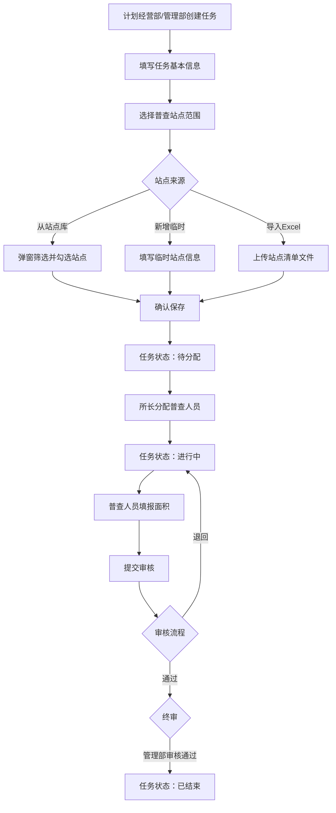

# 业务流程 — 面积普查管理系统

> 最后更新：2026-07-21 | 增量更新，标注 `[待确认]` 项需确认
>
> **约定：** 状态机、流转条件、角色权限矩阵以本文档为唯一权威来源。修改须同步更新所有引用页面。

---

## 一、状态机 ✅ 已确认

### 1.1 完整状态流转

```
┌─────────┐    ┌──────────────┐    ┌──────────────┐    ┌──────────────┐    ┌──────────────┐    ┌────────┐
│  待分配  │ ─→ │ 普查人员填报  │ ─→ │  片区所审核   │ ─→ │ 管理部专工审核 │ ─→ │ 管理部主任审核 │ ─→ │ 已结束  │
└─────────┘    └──────────────┘    └──────────────┘    └──────────────┘    └──────────────┘    └────────┘
                     ↑                    ↑                   ↑
                     │                    │                   │
                     └── 退回 ────────────┼───────────────────┘
                                          │
                          主任可退：专工/片区所/填报
                          专工可退：片区所/填报
                          片区所可退：填报
```

**6 个任务状态（2026-07-21）：**

| 状态 | 可进入 | 可退出到 | 触发条件 |
|------|--------|----------|----------|
| 待分配 | 创建任务后 | 普查人员填报 | 所长分配普查人员 |
| 普查人员填报 | 待分配 / 任意级退回 | 片区所审核 | 普查人员完成填报并提交 |
| 片区所审核 | 普查人员填报 / 上级退回 | 管理部专工审核 / 普查人员填报 | 通过 / 退回 |
| 管理部专工审核 | 片区所审核通过 / 主任退回 | 管理部主任审核 / 片区所审核 / 普查人员填报 | 通过 / 退回 |
| 管理部主任审核 | 专工审核通过 | 已结束 / 专工审核 / 片区所审核 / 普查人员填报 | 通过 / 退回 |
| 已结束 | 主任审核通过 | — | 终审通过 |

**审核链：** 片区所审核 → 管理部专工审核 → 管理部主任审核（三级串行）

**管理部审核为两级内部审核：** 专工（先）→ 主任（后）

### 1.2 需要废弃/修正的历史定义

| 历史状态 | 处理方式 |
|----------|----------|
| 管理部审核（单级） | 废弃，拆分"管理部专工审核"+"管理部主任审核" |
| 站长审核 | 废弃，不存在此角色 |
| 草稿（规格文档） | 废弃，统一为"待分配" |
| 已完成（规格文档） | 废弃，统一为"已结束" |
| 进行中（旧称） | 废弃，统一为"普查人员填报" |
| 进行中（已撤回） | [待确认：撤回后回到哪个状态？] |
---

## 二、角色权限矩阵

> ⚠️ 部分基于代码片段推断，需逐项确认

| 操作 | 计划经营部 | 管理部专工 | 管理部主任 | 所长 | 普查人员 |
|------|:---------:|:---------:|:---------:|:---:|:-------:|
| 查看任务列表 | ✅ | ✅ | ✅ | ✅ | [待确认] |
| 创建任务 | ✅ | ✅ | [待确认] | [待确认] | [待确认] |
| 编辑任务基础信息 | [待确认] | [待确认] | [待确认] | [待确认] | [待确认] |
| 编辑进行中站点 | ✅ | ❌ | ❌ | [待确认] | [待确认] |
| 分配普查人员 | [待确认] | [待确认] | [待确认] | ✅ | [待确认] |
| 转派/改派人员 | [待确认] | [待确认] | [待确认] | ✅ | [待确认] |
| 执行普查填报 | [待确认] | [待确认] | [待确认] | [待确认] | ✅ |
| 片区所审核 | [待确认] | [待确认] | [待确认] | ✅ | [待确认] |
| 管理部专工审核 | [待确认] | ✅ | [待确认] | [待确认] | [待确认] |
| 管理部主任审核 | [待确认] | [待确认] | ✅ | [待确认] | [待确认] |
| 删除任务 | [待确认] | [待确认] | [待确认] | [待确认] | [待确认] |

**已确认的规则：**
- 管理部可创建任务，但不具备进行中任务站点的编辑权限（来源：编辑页提示）
- 所长可分配、转派、改派和审核本所任务（来源：站点级任务页提示）
- 管理部审核为两级：专工先审核，主任后审核 ✅
- 不存在"站长审核"角色 ✅

---

## 三、核心业务流程

### 3.1 任务管理主流程



### 3.2 审核流程 ✅ 已确认

```
普查人员填报完成并提交
      ↓
  片区所审核 ──── 退回 → 只能：普查人员填报
      ↓ 通过
  管理部专工审核 ──── 退回 → 可选择：片区所审核 / 普查人员填报
      ↓ 通过
  管理部主任审核 ──── 退回 → 可选择：管理部专工审核 / 片区所审核 / 普查人员填报
      ↓ 通过
  已结束
```

**审核链：** 片区所审核 → 管理部专工审核 → 管理部主任审核（三级串行）

**退回选项（由业务确认，2026-07-21）：**

| 当前审核节点 | 可退回的选项 |
|-------------|------------|
| 管理部主任审核 | 管理部专工审核 / 片区所审核 / 普查人员填报 |
| 管理部专工审核 | 片区所审核 / 普查人员填报 |
| 片区所审核 | 普查人员填报 |

**规则：** 每个审核节点可退回到自身以下任意层级，从四个选项中过滤出当前节点"之下"的选项。

> ⚠️ 注意：此前确认"所长审核"为审核节点名称，但退回选项中称为"片区所审核"——需确认这两个名称是否需要统一。[待确认]

### 3.3 人员分配流程

> [待确认] 以下为从站点级任务页推断的流程：

```
所长视角 → 查看本所未分配任务 → 点击"设置人员" → 选择普查人员 → 确认分配
```

- [待确认] 是否支持批量分配？
- [待确认] 转派：已分配任务是否可以转给其他人员？
- [待确认] 改派：进行中是否可以更换人员？

---

## 四、数据范围规则

| 角色 | 可见数据范围 | 来源 |
|------|-------------|------|
| 计划经营部 | [待确认] | |
| 管理部专工/主任 | [待确认：仅本管理部？全部？] | |
| 所长（片区所） | 仅本片区所的任务 | 站点级任务页提示 |
| 普查人员 | [待确认：仅分配给自己的任务] | |

---

## 五、异常流程

| 异常场景 | 当前处理 | 待确认 |
|----------|----------|--------|
| 站点已被其他任务占用 | 未校验 | [待确认] 是否需要时间冲突检测？（新建页提示"仅作风险提示"） |
| 任务超期未完成 | 未处理 | [待确认] 是否需要超期提醒/自动关闭？ |
| 审核超时 | 未处理 | [待确认] 审核时限？超时处理规则？ |
| 创建任务后未选择站点 | 未校验 | [待确认] 是否允许创建空站点任务？ |
| 导入文件格式错误 | 未实现 | [待确认] 错误处理策略（跳过/终止/提示） |
| 临时站点信息不完整 | 前端校验必填 | [待确认] 后端是否需要二次校验？ |
| 已结束任务的操作 | 未限制 | [待确认] 已结束任务是否允许查看、是否允许编辑？ |

---

## 六、已确认事项（2026-07-21）

| 序号 | 事项 | 结论 |
|------|------|------|
| 1 | 任务状态机 | 待分配 → 普查人员填报 → 片区所审核 → 管理部专工审核 → 管理部主任审核 → 已结束 |
| 2 | 审核流程 | 三级串行：片区所 → 专工 → 主任 |
| 3 | 管理部审核 | 两级内部审核：专工（先）→ 主任（后） |
| 4 | 不存在站长审核 | 确认无站长审核角色 |
| 5 | 退回规则 | 可退回到下级任意层级；主任可退专工/片区所/填报，专工可退片区所/填报，片区所可退填报 |
| 6 | 退回选项标签 | 管理部主任审核、管理部专工审核、片区所审核、普查人员填报 |

## 七、待确认事项汇总

| 序号 | 事项 | 优先级 | 影响范围 |
|------|------|--------|----------|
| 1 | 角色与权限矩阵（完整） | 🔴 高 | 所有页面 |
| 2 | 退回时是否需要填写退回原因 | 🔴 高 | 审核页面 |
| 3 | 数据范围规则 | 🔴 高 | 列表/筛选 |
| 4 | "已撤回"的触发条件和目标状态 | 🟡 中 | 列表/站点级 |
| 5 | 站点时间冲突处理 | 🟡 中 | 新建/编辑 |
| 6 | 导入模板格式 | 🟡 中 | 新建页 |
| 7 | 任务超时处理 | 🟢 低 | 列表/监控 |
| 8 | 附件上传需求 | 🟢 低 | 详情/审核 |
| 9 | 正式站点编号规则 | 🟢 低 | 站点管理 |
