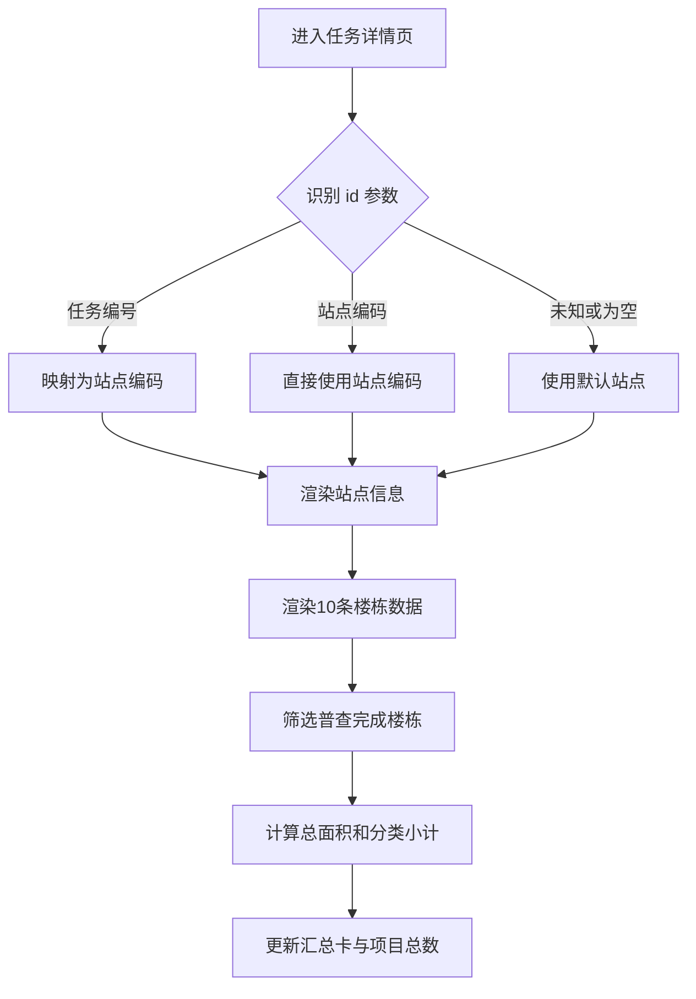

# 任务详情楼栋数据恢复 — 功能规格说明书

> 版本：V1.0
> 日期：2026-07-22
> 状态：已实施，交互验收由用户执行
> 适用页面：`plan-outside-survey-task-detail.html`

## 一、问题定义

任务详情页在渲染站点信息时引用了未定义变量 `code`，产生 JavaScript `ReferenceError`。脚本在楼栋表格渲染前中断，导致页面显示 0 条楼栋数据，面积汇总也全部为 0。

## 二、功能目标

- 恢复页面当前已配置的 10 条楼栋数据。
- 根据“普查完成”的楼栋自动计算本次填报面积及分类小计。
- 同时兼容任务编号和站点编码两种详情入口。
- 修复异常时不改变现有楼栋字段、详情弹窗、审批记录和页面样式。

## 三、入口参数规则

| URL 参数示例 | 含义 | 处理方式 |
|--------------|------|----------|
| `?id=OUT-2026-001` | 任务编号 | 通过任务—站点映射得到 `60218B001` |
| `?id=60218B001` | 站点编码 | 直接读取对应站点数据 |
| 无参数或未知参数 | 无法准确定位 | 原型回退至默认站点 `60218B001` |

两个已知入口均应展示春江花月西站站点信息、10 条楼栋数据和自动汇总结果。

## 四、楼栋展示规则

- 使用页面当前 `buildings` 数组中的 10 条模拟数据。
- 表格应展示序号、楼栋或建筑物名称、层数、用热性质、收费类别、普查状态、原面积、现面积、变化、变化率、控制方式、暖气类型、年代、普查依据、附件和操作。
- 分页总数显示“总共 10 个项目”。
- 单条楼栋“查看”入口继续打开现有楼栋详情弹窗。

## 五、面积统计规则

- 只统计普查状态为“完成”的楼栋。
- 本次填报总面积为已完成楼栋 `current` 的有效数值之和。
- 住宅分类小计：收费类别不是“非居民/非居”的已完成楼栋面积之和。
- 非住宅分类小计：收费类别为“非居民”或“非居”的已完成楼栋面积之和。
- 多层、公寓、高层、非居、非协按收费类别分别累计。
- `current` 为 `/`、空值或非数值时按 0 处理。
- 汇总结果延续当前原型规则取整展示。

## 六、用户故事

作为任务查看或审核人员，我希望从任一任务入口进入详情页时都能看到该站点的楼栋数据和自动面积汇总，以便核对普查结果。

## 七、业务流程



## 八、验收标准

```gherkin
场景: 通过任务编号进入详情
  当 用户访问详情页并传入 id=OUT-2026-001
  那么 页面展示春江花月西站
  并且 楼栋表格展示10条数据
  并且 项目总数显示10

场景: 通过站点编码进入详情
  当 用户访问详情页并传入 id=60218B001
  那么 页面展示与任务编号入口一致的站点和楼栋数据

场景: 自动汇总面积
  当 楼栋数据渲染完成
  那么 系统只累计普查状态为“完成”的楼栋现面积
  并且 更新总面积、住宅、非住宅及细分类小计

场景: 待普查楼栋没有现面积
  假如 楼栋现面积为“/”
  当 系统计算汇总
  那么 该楼栋按0计入
```

## 九、异常与边界

- 页面不得再引用未定义变量。
- 站点信息渲染异常不得阻断楼栋表格和汇总渲染；实施时将参数解析结果集中保存，避免跨函数使用不存在的局部变量。
- 未知参数使用默认站点仅用于原型兜底，正式系统应展示明确的无数据状态。

## 十、确认状态

### 已确认

- 展示当前代码配置的 10 条楼栋数据。
- 面积根据“普查完成”的楼栋自动计算。
- 两类现有入口应进入同一详情页并正常展示数据。

### 待确认

- 无。页面已按本规格实施，浏览器交互验收由用户执行。
