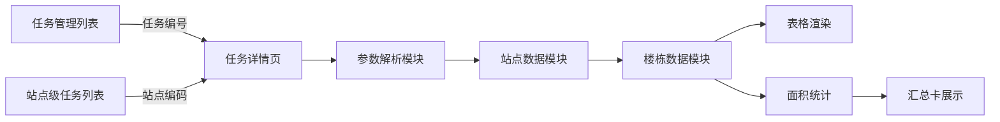
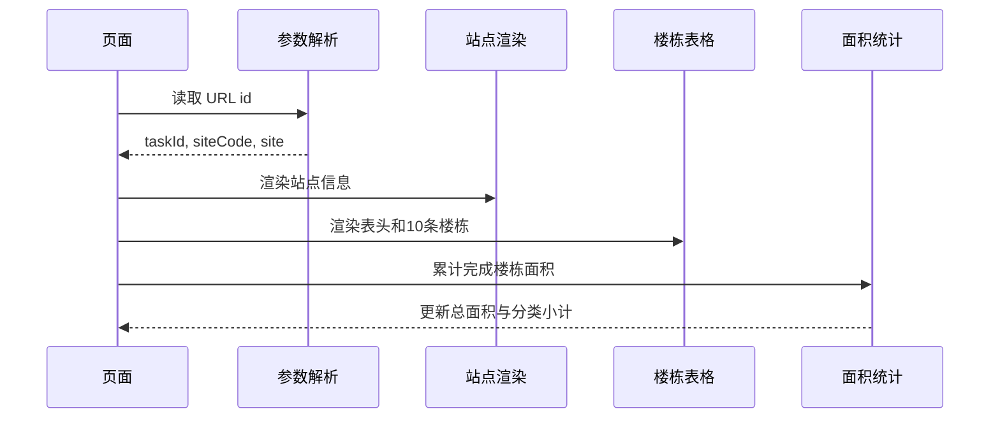

# 任务详情楼栋数据恢复 — 系统建设方案

> 版本：V1.0
> 日期：2026-07-22
> 状态：已实施，交互验收由用户执行
> 关联规格：`docs/任务详情楼栋数据恢复-功能规格说明书.md`

## 一、建设目标

修复详情页初始化阶段的未定义变量异常，统一解析任务编号和站点编码，使站点信息、楼栋表格及面积汇总按稳定顺序完成渲染。

## 二、产品架构

## 三、根因与修复策略

### 3.1 根因

`renderSite()` 已取得 `taskId`、`siteCode` 和站点对象 `s`，但生成副标题时错误使用不存在的变量 `code`。异常发生后，后续 `renderThead()`、`renderBuildings()` 和 `refreshStats()` 均未执行。

### 3.2 修复策略

- 新增统一的详情上下文解析函数，返回 `inputId`、`taskId`、`siteCode` 和 `site`。
- 识别 `OUT-` 开头的任务编号，通过 `taskSiteMap` 转换为站点编码。
- 识别 `siteMock` 中存在的站点编码，直接使用。
- 未知或空参数回退到默认任务和站点。
- 副标题使用已解析的任务编号；站点编码入口无法反查时使用匹配到的任务编号或稳定的演示编号。
- 确保站点信息渲染完成后继续执行表头、楼栋数据和面积汇总渲染。

## 四、模块划分

| 模块 | 调整内容 | 影响范围 |
|------|----------|----------|
| 参数解析 | 统一识别任务编号、站点编码和默认值 | 页面初始化 |
| 站点渲染 | 使用解析后的上下文，移除未定义变量 | 标题、站点信息、页面标题 |
| 楼栋表格 | 沿用现有10条数据及渲染函数 | 汇总表 |
| 面积统计 | 沿用并验证“完成楼栋”累计规则 | 两张面积卡及分类小计 |
| 异常保护 | 确保未知参数有原型兜底 | 所有详情入口 |
| 文档同步 | 更新页面清单和问题记录 | `docs/页面清单.md` |

## 五、核心初始化顺序

## 六、Ant Design 组件选型说明

当前原型继续使用原生 HTML/CSS/JavaScript，对应 Ant Design 实现语义如下：

| 场景 | Ant Design 对应组件 | 本期处理 |
|------|---------------------|----------|
| 楼栋列表 | `Table` | 恢复现有10条模拟数据渲染 |
| 普查状态 | `Tag` | 保留完成/待普查标签 |
| 汇总统计 | `Statistic` / `Card` | 根据完成楼栋自动计算 |
| 分页 | `Pagination` | 总数与楼栋数组长度一致 |
| 楼栋详情 | `Modal` | 保留现有查看交互 |

## 七、实施步骤

1. 修正 URL 参数与详情上下文解析。
2. 删除 `renderSite()` 对未定义 `code` 的引用。
3. 确认两类入口均解析到 `60218B001`。
4. 保持并验证10条楼栋数据渲染。
5. 验证面积汇总只累计状态为“完成”的楼栋。
6. 同步页面清单中的详情页说明和已知问题。
7. 执行内联脚本语法、未定义标识符、数据数量、统计结果和差异格式检查。

## 八、验证方案

### 8.1 静态验证

- 内联 JavaScript 可成功解析。
- 不再存在对未定义 `code` 的引用。
- `buildings.length === 10`。
- 完成楼栋统计结果可从模拟数据稳定计算。
- `git diff --check` 通过。

### 8.2 交互验收

- 分别通过任务编号和站点编码打开详情页，数据一致。
- 表格显示10条楼栋，项目总数为10。
- 两张面积卡及分类小计显示自动计算结果。
- 楼栋“查看”弹窗、Tabs 和审批记录无回归。

## 九、风险与控制

| 风险 | 控制措施 |
|------|----------|
| 两类 ID 混用导致映射错误 | 集中解析并返回明确上下文 |
| 一个异常再次阻断全部初始化 | 移除隐式变量依赖，按固定顺序调用渲染函数 |
| 待普查数据被错误计入面积 | 仅累计 `status === 完成` 且现面积可解析的记录 |
| 模拟编号与站点编码不一致 | 优先使用映射表，未知值使用明确默认上下文 |

## 十、授权门禁

方案已于 2026-07-22 获得通过并完成页面实施。静态与数据计算检查由实施方完成，浏览器交互验收由用户执行。
