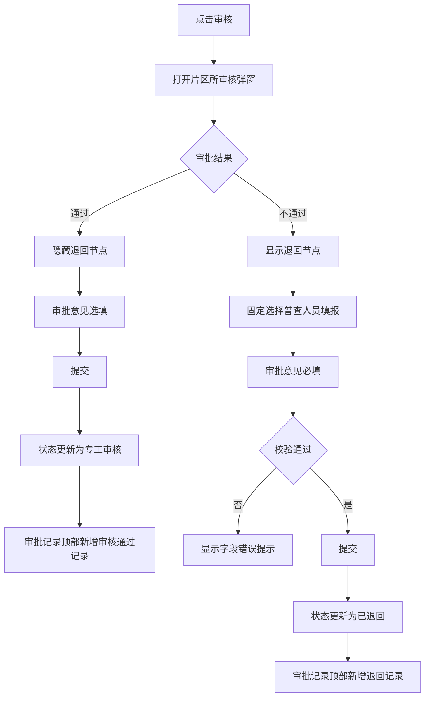

# 任务详情片区所审核弹窗补全 — 功能规格说明书

> 版本：V1.0
> 日期：2026-07-22
> 状态：已实施，交互验收由用户执行
> 适用页面：`plan-outside-survey-task-detail.html`

## 一、功能定义

补全任务详情页的片区所审核弹窗，使审批结果、退回节点、审批意见、校验提示、状态更新和审批记录形成完整闭环。

## 二、角色与当前节点

- 当前演示审核角色：片区所。
- 当前审核节点：片区所审核。
- 演示审核人：沿用页面现有审批记录中的李明，角色展示为“所长”。

## 三、字段与规则

| 字段 | 控件 | 通过 | 不通过 |
|------|------|------|--------|
| 审批结果 | 单选 | 可选 | 可选，默认选中 |
| 退回节点 | 下拉 | 隐藏且不校验 | 显示、必填，仅可选择“普查人员填报” |
| 审批意见 | 多行文本 | 选填 | 必填 |
| 字数限制 | 计数提示 | 最多300字 | 最多300字 |

### 3.1 结果联动

- 选择“通过”：隐藏退回节点，清除退回节点错误提示，审批意见变为选填。
- 选择“不通过”：显示退回节点，默认选择“普查人员填报”，审批意见显示必填标识。
- 关闭或取消弹窗后，下次打开恢复默认值：不通过、普查人员填报、意见为空。

## 四、提交结果

### 4.1 审核通过

- 页面状态标签更新为“专工审核”。
- 审批记录顶部新增“片区所审核”记录。
- 记录结果显示“审核通过”。
- 审批意见为空时记录“审核通过，无补充意见”。
- 提交成功后关闭弹窗。

### 4.2 审核不通过

- 页面状态标签更新为“已退回”。
- 审批记录顶部新增“片区所审核”记录。
- 记录结果显示“已退回至普查人员填报”。
- 记录展示填写的审批意见，并使用退回提示样式。
- 提交成功后关闭弹窗。

## 五、用户故事

作为片区所审核人员，我希望在任务详情页明确选择通过或不通过，并在退回时指定合法节点和填写意见，以便形成可追溯的审核记录。

## 六、业务流程



## 七、验收标准

```gherkin
场景: 选择审核通过
  当 用户选择“通过”
  那么 退回节点隐藏
  并且 审批意见为选填
  当 用户点击确定
  那么 页面状态更新为“专工审核”
  并且 审批记录顶部新增审核通过记录

场景: 选择审核不通过
  当 用户选择“不通过”
  那么 显示退回节点
  并且 退回节点只能选择“普查人员填报”
  并且 审批意见为必填

场景: 不通过时未填写意见
  假如 用户选择“不通过”且审批意见为空
  当 用户点击确定
  那么 不提交审核
  并且 在审批意见处显示必填提示

场景: 提交退回
  假如 用户选择“不通过”并填写审批意见
  当 用户点击确定
  那么 页面状态更新为“已退回”
  并且 审批记录顶部新增退回记录

场景: 取消后重新打开
  当 用户取消并再次打开审核弹窗
  那么 弹窗恢复默认的不通过状态
  并且 审批意见为空
```

## 八、异常与边界

- 审批意见只输入空格视为空值。
- 输入达到300字后禁止继续输入，并显示 `300/300`。
- 重复点击确定时只产生一条审批记录。
- 校验失败时弹窗保持打开，不更新状态和审批记录。
- 本期为前端原型，不持久化刷新后的审核结果。

## 九、确认状态

### 已确认

- 当前按片区所审核演示。
- 通过时隐藏退回节点，审批意见选填。
- 不通过时显示退回节点，审批意见必填。
- 片区所只能退回“普查人员填报”。
- 提交后更新状态并在审批记录顶部新增本次记录。

### 待确认

- 无。页面已按本规格实施，浏览器交互验收由用户执行。
