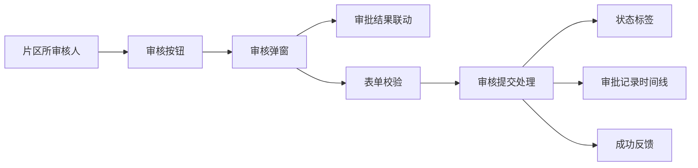

# 任务详情片区所审核弹窗补全 — 系统建设方案

> 版本：V1.0
> 日期：2026-07-22
> 状态：已实施，交互验收由用户执行
> 关联规格：`docs/任务详情片区所审核弹窗补全-功能规格说明书.md`

## 一、建设目标

在现有原生 HTML/CSS/JavaScript 详情页中补全片区所审核弹窗的字段联动、校验、提交反馈和页面状态更新，形成可演示的完整审核闭环。

## 二、产品架构



## 三、模块划分

| 模块 | 建设内容 | 影响位置 |
|------|----------|----------|
| 弹窗表单 | 审批结果、退回节点、审批意见、字数计数 | 审核弹窗 HTML |
| 结果联动 | 通过隐藏节点，不通过显示节点 | 单选框 change 事件 |
| 表单校验 | 退回节点和意见必填、300字限制 | 提交处理函数 |
| 状态更新 | 通过→专工审核，不通过→已退回 | `statusChip` |
| 审批记录 | 创建记录并插入时间线顶部 | `approval-list` |
| 重置逻辑 | 关闭、取消、提交后恢复默认状态 | 弹窗生命周期 |
| 样式 | 必填标识、错误提示、字数计数、退回记录 | 页面局部 CSS |
| 文档同步 | 更新业务流程、交互规则和页面清单 | `docs/` |

## 四、核心交互逻辑

### 4.1 弹窗状态模型

```js
{
  result: 'reject',
  returnNode: '普查人员填报',
  comment: '',
  submitting: false
}
```

### 4.2 打开与重置

- 点击“审核”前执行表单重置。
- 默认选中“不通过”。
- 默认显示退回节点并选中“普查人员填报”。
- 清空审批意见、错误提示和字数计数。

### 4.3 审批结果联动

- 监听 `auditResult` 单选变化。
- `pass`：隐藏退回节点行，必填标识隐藏。
- `reject`：显示退回节点行，必填标识显示。
- 联动后立即清理与当前结果无关的错误提示。

### 4.4 提交校验

- 提交前读取审批结果、退回节点和去除首尾空格后的意见。
- 不通过时节点或意见为空则阻止提交并显示就地错误提示。
- 通过时允许意见为空。
- 使用 `submitting` 或临时禁用确定按钮防止重复提交。

### 4.5 页面更新

- 通过：`statusChip` 文案改为“专工审核”，应用专工审核状态样式。
- 不通过：`statusChip` 文案改为“已退回”，应用退回状态样式。
- 使用当前时间生成 `YYYY-MM-DD HH:mm`。
- 新记录插入 `.approval-list` 首位，包含节点、时间、审核人、结果和意见。
- 审核通过记录使用完成样式，退回记录使用警示样式。

## 五、Ant Design 组件选型说明

当前原型不引入 Ant Design 运行依赖，实现语义对应：

| 场景 | Ant Design 组件 | 原型实现 |
|------|-----------------|----------|
| 审核弹窗 | `Modal` | 现有 `.modal` |
| 审批结果 | `Radio.Group` | 原生 radio 组 |
| 退回节点 | `Select` | 原生 select，仅一个合法选项 |
| 审批意见 | `Input.TextArea` | `textarea maxlength=300` |
| 字数计数 | `showCount` | 自定义实时 `0/300` |
| 表单校验 | `Form.Item` | 就地错误文案和错误边框 |
| 提交反馈 | `message.success` | 原型轻量提示或现有 alert |
| 审批记录 | `Timeline` | 现有 `.approval-list` 顶部插入 |

## 六、样式方案

- 弹窗宽度保持现有中型尺寸，字段标签统一宽度。
- 退回节点行通过 `hidden` 或 `display:none` 切换，不保留空白占位。
- 审批意见区域右下角展示字数计数。
- 错误提示位于控件下方，使用危险色，不再只使用全局 alert 表达校验错误。
- 确定按钮提交期间禁用，避免重复记录。

## 七、实施步骤

1. 完善审核弹窗 DOM：节点行 ID、动态必填标识、错误提示、字数计数。
2. 将退回节点改为唯一合法选项“普查人员填报”。
3. 实现结果切换与字段联动。
4. 实现表单重置和300字计数。
5. 实现通过/退回校验及防重复提交。
6. 实现状态标签更新和审批记录顶部插入。
7. 同步业务流程、交互规则和页面清单。
8. 执行脚本语法、DOM 引用、状态流转、记录模板及差异格式检查。

## 八、验证方案

### 8.1 静态验证

- 内联 JavaScript 语法正确。
- 所有新增 DOM ID 均存在且唯一。
- 退回节点只有“普查人员填报”。
- 意见 `maxlength` 为300。
- `git diff --check` 通过。

### 8.2 交互验收

- 通过/不通过切换时节点行和必填标识正确联动。
- 不通过空意见无法提交，并显示就地错误。
- 通过空意见可提交。
- 提交后状态标签和审批记录同步更新。
- 取消或关闭后重新打开恢复默认状态。
- 连续点击确定不会产生重复记录。

## 九、风险与控制

| 风险 | 控制措施 |
|------|----------|
| 使用旧退回节点名称 | 节点选项固定为已确认的“普查人员填报” |
| 通过仍校验退回字段 | 校验按审批结果分支执行 |
| 重复提交产生多条记录 | 提交期间禁用按钮并设置状态锁 |
| 动态记录包含特殊字符 | 插入 DOM 时使用文本节点或统一转义函数 |
| 状态标签样式残留 | 更新前清除旧状态类，再应用目标类 |

## 十、授权门禁

方案已于 2026-07-22 获得通过并完成页面实施。静态与状态流转检查由实施方完成，浏览器交互验收由用户执行。
