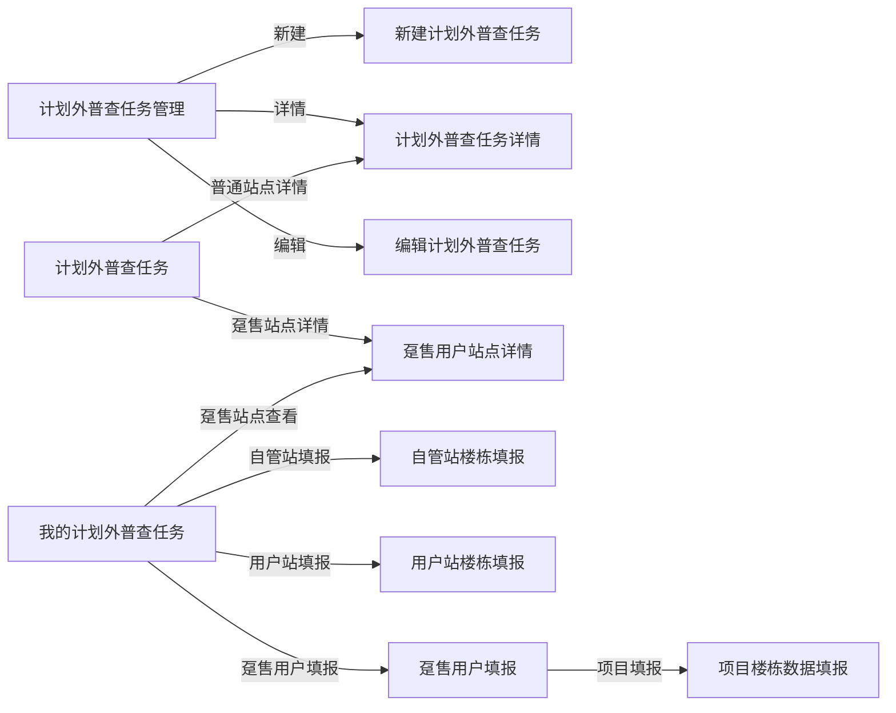

# 工作区原型导入 Figma — 功能规格说明书

> 版本：V1.0  
> 日期：2026-07-22  
> 状态：待方案确认  
> 目标文件：[余额提现](https://www.figma.com/design/jpdL8OwOeac1tPi3NUCLir/%E4%BD%99%E9%A2%9D%E6%8F%90%E7%8E%B0?node-id=0-1)  
> 内容基准：当前工作区 HTML、`pc-template-base.css` 与现有业务文档

## 1. 功能定义

将当前工作区内 11 个 HTML 原型页面的默认展示状态，高保真、可编辑地绘制到指定 Figma 文件中，形成可继续设计、评审和标注的页面集合。

本次属于原型迁移，不改变既有业务规则、页面内容、字段、状态和权限；Figma 结果以当前 HTML 的实际默认渲染效果为准。

### 1.1 已确认范围

- 使用用户提供的 Figma 文件，不新建文件。
- 导入工作区全部 11 个 HTML 页面。
- `plan-outside-survey-task-dh-fill.html` 与 `plan-outside-survey-task-dh-project-fill.html` 虽未登记在现有《页面清单》中，仍纳入本次导入。
- 第一阶段仅绘制各页面首次打开时的默认状态。
- 采用高保真、可编辑的 Figma 图层结构，不使用整页截图作为最终交付物。
- 保留当前 Ant Design 风格、顶栏、侧栏、页面导航、字段和值。

### 1.2 本期不包含

- 不展开筛选结果、弹窗、抽屉、下拉菜单、Toast、上传状态等交互状态。
- 不单独绘制 Tab 切换后状态、空状态、错误状态、加载状态或权限差异状态。
- 不新增页面，不补齐占位页功能，不修订旧状态文案。
- 不修改工作区 HTML、CSS、JavaScript 或业务文档中的既有规则。
- 不要求本期建立完整可点击的 Figma Prototype 跳转关系；页面间关系通过分组和命名表达。

## 2. 用户故事

### 2.1 产品与业务人员

作为产品或业务评审人员，我希望在一个 Figma 文件中查看当前工作区全部原型页面，以便集中评审页面结构、字段和业务呈现，而不需要逐个打开本地 HTML 文件。

### 2.2 设计人员

作为设计人员，我希望导入后的页面由可编辑的文本、容器、表格和表单图层组成，以便继续调整视觉细节、补充交互状态和添加评审批注。

### 2.3 研发人员

作为研发人员，我希望 Figma 页面与当前 HTML 原型保持一致，并保留明确的页面文件映射，以便在设计稿、原型文件和源码之间快速定位。

## 3. 页面范围

| 序号 | Figma 画板名称 | 源文件 | 默认态主要内容 | 当前状态 |
|---:|---|---|---|---|
| 01 | 计划外普查任务管理 | `plan-outside-survey-task-list.html` | 页面标题、筛选区、任务列表、分页、新建与刷新操作 | 已完成 |
| 02 | 新建计划外普查任务 | `plan-outside-survey-task-create.html` | 任务信息表单、计划外普查范围、添加站点入口 | 已完成 |
| 03 | 计划外普查任务 | `plan-outside-survey-task-items.html` | 筛选区、普查原因 Tabs、站点级任务表格、分页 | 已完成 |
| 04 | 计划外普查任务详情 | `plan-outside-survey-task-detail.html` | 站点信息、面积统计、楼栋明细、附件/审批区域 | 已完成 |
| 05 | 编辑计划外普查任务 | `plan-outside-survey-task-edit.html` | 任务编号、编辑权限说明、返回操作 | 占位 |
| 06 | 我的计划外普查任务 | `plan-outside-survey-task-worker.html` | 筛选区、普查原因 Tabs、个人任务表格、分页 | 已完成 |
| 07 | 自管站楼栋填报 | `plan-outside-survey-task-self-fill.html` | 站点信息、附件、面积统计、楼栋数据、底部操作栏 | 已完成 |
| 08 | 用户站楼栋填报 | `plan-outside-survey-task-user-fill.html` | 用户站信息、附件、面积统计、楼栋数据、底部操作栏 | 已完成 |
| 09 | 趸售用户填报 | `plan-outside-survey-task-dh-fill.html` | 站点信息、普查项目列表、导入/新增、底部操作栏 | 已完成，未登记页面清单 |
| 10 | 项目楼栋数据填报 | `plan-outside-survey-task-dh-project-fill.html` | 项目信息、楼栋数据、导入/导出/小结、保存 | 已完成，未登记页面清单 |
| 11 | 趸售用户站点详情 | `plan-outside-survey-task-dh-detail.html` | 站点信息、项目列表、审批记录与审核入口 | 已完成 |

## 4. 默认状态定义

默认状态统一指：页面在未进行点击、输入、筛选、翻页或切换 Tab 时，按照源码默认参数和模拟数据首次渲染出的可见界面。

- URL 参数缺失时，沿用源码内置默认站点、任务和来源逻辑。
- 默认关闭所有模态框、抽屉、下拉菜单和提示层。
- 默认保留源码首次渲染的列表数据、计数、状态标签和分页位置。
- 对固定底部操作栏、横向宽表、审批侧栏等默认可见结构进行完整绘制。
- HTML 中因视口高度而需滚动查看的内容，在 Figma 中使用足够高度的完整页面画板承载，不裁掉有效内容。

## 5. 业务流程图

本图用于说明 11 个页面在现有业务链条中的位置；本次只迁移页面默认态，不新增或修改业务流转。

## 6. 页面还原要求

### 6.1 视觉还原

- 基准画板宽度按当前 PC 中后台页面设计，默认采用 1440 px。
- 顶栏高度 56 px，侧栏宽度 220 px。
- 品牌主色沿用 `#4C78F5`，页面背景沿用 `#F3F6FA`。
- 保留现有卡片、表格、标签、按钮、分页、表单的尺寸层级与高信息密度风格。
- 中文字体优先匹配当前系统字体栈中 Figma 可用字体；不得擅自使用与当前页面观感差异明显的西文字体替代。

### 6.2 可编辑性

- 页面标题、字段名、表格内容、按钮文字必须为可编辑文本。
- 卡片、表格、表单、状态标签和按钮使用独立图层或 Auto Layout 容器。
- 页面画板名称必须包含两位序号和中文页面名。
- 画板描述或一级分组名称中保留源 HTML 文件名。
- 不得把整页 PNG/JPG 截图作为最终可编辑页面。

### 6.3 内容一致性

- 不纠正源码中的旧状态、旧角色称谓或演示数据。
- 不根据文档推测源码中未显示的字段或内容。
- 源码默认态与文档描述不一致时，Figma 视觉呈现以源码实际渲染为准，并在交付说明中记录差异。

## 7. 异常与边界处理

| 场景 | 处理方式 |
|---|---|
| 页面高度超过常规视口 | 扩展 Figma 画板高度，完整承载默认态内容 |
| 宽表需要横向滚动 | 按源码可见视口还原，并保留固定列/滚动容器的视觉关系 |
| 页面为占位功能 | 按现有占位内容原样导入，不补全功能 |
| CSS 使用系统字体 | 在 Figma 中选择观感最接近且可用的中文字体 |
| 图标由字符或 CSS 生成 | 使用可编辑矢量、文本或简单形状近似还原 |
| 默认数据由 JavaScript 注入 | 以页面首次渲染后的真实可见内容为准 |
| 页面清单未登记源文件 | 纳入本次 11 页交付，并在画板描述中标明来源 |

## 8. 性能与文件约束

- 第一阶段仅绘制 11 个默认态，控制 Figma 文件节点数量和加载时间。
- 重复结构采用一致的图层命名和 Auto Layout，避免无意义的深层嵌套。
- 单个页面完成后逐页截图检查，避免全部创建后集中返工。
- 页面捕获参考仅用于视觉比对，最终交付保留可编辑结构。

## 9. 验收标准

- 指定 Figma 文件中存在 11 个可识别、无遮挡的默认态页面画板。
- 每个画板与源 HTML 文件建立一一对应关系，无遗漏、无重复。
- 页面主要布局、导航、字段、表格列、默认数据、状态标签和按钮与源码一致。
- 文本、主要容器、表格和按钮可在 Figma 中独立编辑。
- 页面不存在明显文字裁切、元素重叠、错位或超出画板的问题。
- 画板按业务链路分组并按序号排列，评审者可快速定位。
- 本期未擅自加入弹窗展开态、Tab 切换态或新业务内容。

## 10. 待后续确认项

- 是否在第二阶段补充关键弹窗、空状态、审核状态和 Tab 切换状态。
- 是否补充 Figma Prototype 页面跳转与点击热区。
- 是否将重复结构进一步整理为可发布的 Figma 组件库。

