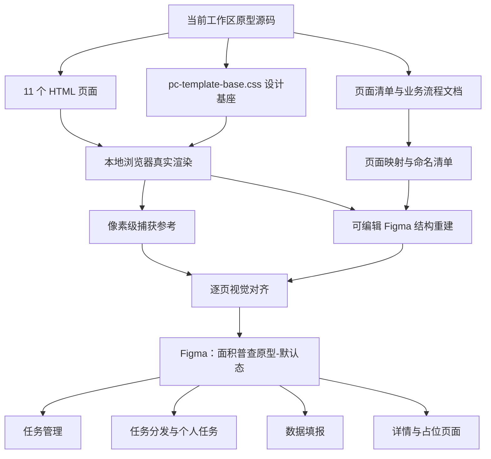
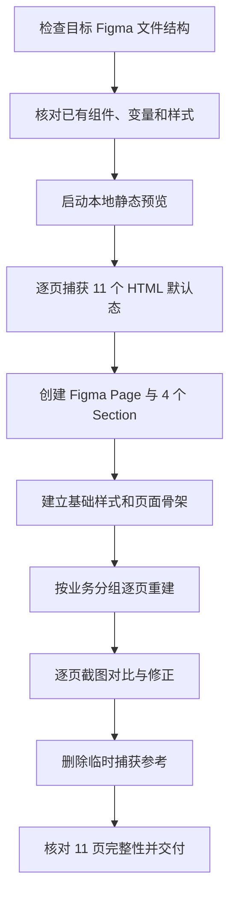

# 工作区原型导入 Figma — 系统建设方案

> 版本：V1.0  
> 日期：2026-07-22  
> 状态：待方案确认  
> 前置文档：`docs/工作区原型导入Figma-功能规格说明书.md`

## 1. 建设目标

在指定 Figma 文件中新增“面积普查原型-默认态”页面，将工作区 11 个 HTML 原型的默认状态转化为高保真、可编辑的 Figma 画板。实施时保留现有空白页和文件名称，不覆盖文件中已有内容。

## 2. 产品架构图

## 3. Figma 信息架构

### 3.1 页面策略

- 保留目标文件现有页面，不重命名、不覆盖。
- 新建 Figma Page：`面积普查原型-默认态`。
- 在该 Page 内按业务链路建立 4 个 Section。
- 每个 HTML 页面对应 1 个顶层 Frame，默认宽度 1440 px，高度按实际内容自适应。

### 3.2 Section 与画板顺序

| Section | 画板 |
|---|---|
| 01 任务管理 | 01 计划外普查任务管理、02 新建计划外普查任务、05 编辑计划外普查任务 |
| 02 任务分发与个人任务 | 03 计划外普查任务、06 我的计划外普查任务 |
| 03 数据填报 | 07 自管站楼栋填报、08 用户站楼栋填报、09 趸售用户填报、10 项目楼栋数据填报 |
| 04 详情页面 | 04 计划外普查任务详情、11 趸售用户站点详情 |

Section 横向排列，Section 内画板纵向排列；画板之间保留统一间距，避免遮挡和跨区混放。

## 4. 模块划分

### 4.1 源码分析模块

- 读取 HTML 结构、默认数据和页面入口。
- 读取 CSS 变量、布局尺寸、字体栈和组件样式。
- 记录页面默认视图、内容高度、宽表和固定操作栏。
- 搜索 Code Connect 文件；当前工作区未发现对应映射文件时，记录为不适用。

### 4.2 本地渲染与捕获模块

- 使用只读本地静态服务打开 11 个 HTML 页面。
- 以 1440 px PC 视口渲染页面默认态。
- 将网页捕获结果写入同一 Figma 文件，作为布局和图片参考。
- 捕获参考不作为最终交付画板；完成对齐后删除临时捕获内容。

### 4.3 Figma 基础样式模块

优先检查目标文件已有组件、变量和样式。目标文件无可复用设计系统时，按源码建立本次页面需要的本地样式基础：

- 颜色：品牌色、背景色、卡片色、边框色、正文/次级/弱化文本色、成功/警告/危险色。
- 尺寸：56 px 顶栏、220 px 侧栏、常用 4/6/8 px 圆角。
- 间距：页面、卡片、表单、表格和按钮的常用间距。
- 字体：使用 Figma 中实际可用、与当前中文系统字体栈观感接近的字体。

本期不建设独立发布型组件库，仅保证 11 个页面内部命名一致、结构可编辑。

### 4.4 页面骨架模块

每个页面先创建顶层画板，再直接在画板内建立：

1. 顶栏；
2. 侧栏；
3. 主内容区域；
4. 面包屑与页面标题；
5. 页面主体卡片、表格或表单；
6. 分页、底部操作栏或审批侧栏。

相关元素使用 Auto Layout，不先创建散落节点再跨调用重组。

### 4.5 视觉验证模块

- 每完成一个页面，生成 Figma 画板截图。
- 与本地 HTML 默认态捕获结果比对布局、尺寸、文本、颜色和信息密度。
- 检查画板元数据和图层结构，确认无重叠、裁切和遗漏。
- 出现差异时只修正目标页面，不批量重建已通过页面。

## 5. 核心交互逻辑说明

本期交付为默认态静态高保真原型，交互逻辑按以下原则处理：

- 按钮、筛选项、Tab、分页和操作链接保留视觉可识别性，但不配置点击动作。
- 模态框、上传面板、详情弹层和审核弹窗默认关闭，不创建独立画板。
- 下拉框、日期选择器、复选框等保留默认未展开状态。
- 列表沿用源码默认数据与默认分页。
- 底部固定操作栏在 Figma 中放置于页面内容底部，并保持其与主内容的视觉关系。
- 审批记录等默认可见侧栏按源码还原；仅交互触发后出现的审核弹窗不绘制。

## 6. Ant Design 组件选型说明

当前页面为自研 CSS 实现的 Ant Design 风格原型。Figma 中按下表建立语义对应关系，不强行替换源码视觉参数。

| 页面结构/元素 | Ant Design 对应组件 | Figma 表达方式 |
|---|---|---|
| 顶部导航 | `Layout.Header` | 固定高度 Auto Layout Frame |
| 左侧导航 | `Layout.Sider`、`Menu` | 纵向 Auto Layout，保留选中态 |
| 面包屑 | `Breadcrumb` | 可编辑文本与分隔符 |
| 内容卡片 | `Card` | 带边框、圆角、标题区的 Auto Layout |
| 查询区域 | `Form`、`Input`、`Select`、`DatePicker` | 标签与控件组合，保持高密度布局 |
| 主次按钮 | `Button` | Primary、Default、Text 三类视觉样式 |
| 数据列表 | `Table` | 表头、数据行、固定操作列和宽表容器 |
| 状态展示 | `Tag`、`Badge`、`Progress` | 独立可编辑状态标签和进度条 |
| 页面分类 | `Tabs` | 默认激活项和计数徽标 |
| 分页 | `Pagination` | 默认页码、上一页、下一页 |
| 文件上传 | `Upload` | 默认未上传状态容器 |
| 信息展示 | `Descriptions`、`Statistic` | 字段网格和统计卡片 |
| 底部操作区 | `Space`、固定操作栏 | 横向 Auto Layout，右对齐操作 |
| 占位和空内容 | `Empty`、`Alert` | 按源码默认可见状态还原 |

## 7. 设计变量建议

变量命名保持简单且对应源码：

| 类型 | 建议变量 | 基准值 |
|---|---|---|
| 品牌色 | `Color/Primary` | `#4C78F5` |
| 页面背景 | `Color/Background` | `#F3F6FA` |
| 卡片背景 | `Color/Card` | `#FFFFFF` |
| 主要文字 | `Color/Text` | `#2C3E50` |
| 次级文字 | `Color/Text Secondary` | `#5A6577` |
| 边框 | `Color/Border` | `#E8ECF1` |
| 成功 | `Color/Success` | `#389E0D` |
| 警告 | `Color/Warning` | `#D48806` |
| 危险 | `Color/Danger` | `#FF4D4F` |
| 顶栏高度 | `Size/Nav Height` | `56` |
| 侧栏宽度 | `Size/Sidebar Width` | `220` |

若目标 Figma 文件已有等价变量，优先复用，不重复创建。

## 8. 实施步骤

## 9. 验证方案

### 9.1 结构验证

- Figma Page、4 个 Section、11 个顶层 Frame 数量正确。
- 画板命名、源文件映射和业务分组正确。
- 文本、容器、表格、按钮均可独立选中和编辑。
- 无临时占位 shimmer、临时捕获页或孤立节点残留。

### 9.2 视觉验证

- 使用本地真实渲染截图作为基准逐页比对。
- 检查顶栏、侧栏、主内容宽度、卡片间距和表格密度。
- 检查中文字体、字号、行高、按钮高度、颜色和边框。
- 检查长文本、表格标题和状态标签无裁切。

### 9.3 内容验证

- 页面标题、筛选字段、表头、默认行数据和操作文案与 HTML 一致。
- 11 个源文件均有对应画板。
- 未绘制本期范围外的弹窗展开态和交互变体。

## 10. 风险与处理

| 风险 | 影响 | 处理方式 |
|---|---|---|
| Figma 可用中文字体与系统字体不同 | 文字宽度和换行存在细微差异 | 先确认可用字体，再按截图调整文本宽度和行高 |
| 宽表节点数量较多 | 文件加载和编辑变慢 | 仅绘制默认页数据，控制嵌套层级 |
| JavaScript 默认数据依赖 URL 参数 | 同页可能存在不同默认内容 | 使用无参数首次打开状态，记录源文件映射 |
| 目标文件为空且无设计系统 | 无现成组件可复用 | 按源码变量建立轻量本地样式，不扩建发布型组件库 |
| 源码与业务文档存在差异 | 评审时可能误解 | 视觉按源码还原，差异在交付说明中单列 |
| 两个页面未登记在页面清单 | 后续归档可能遗漏 | 画板命名中保留源文件，并在本方案中明确纳入 |

## 11. 交付结果

- 指定 Figma 文件内新增 `面积普查原型-默认态` 页面。
- 4 个业务 Section、11 个高保真默认态页面画板。
- 页面内容可编辑，画板与源 HTML 一一对应。
- 逐页视觉检查通过后的交付说明和 Figma 链接。

## 12. 实施授权

本方案通过前，仅完成需求分析和文档输出，不向 Figma 写入任何页面。收到明确“方案通过”后进入实施阶段。

