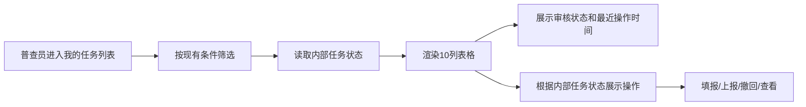

# 我的计划外普查任务列表字段精简 — 功能规格说明书

> 版本：V1.0
> 日期：2026-07-22
> 状态：已实施，交互验收由用户执行
> 适用页面：`plan-outside-survey-task-worker.html`

## 一、功能定义

精简“我的计划外普查任务”表格，删除“任务状态”和“下发状态”两个展示列，保留审核状态、最近操作时间及现有任务操作，降低普查员列表中的重复状态信息密度。

## 二、本期范围

- 删除表格中的“任务状态”列。
- 删除表格中的“下发状态”列。
- 表格由 12 列调整为 10 列。
- 保留“审核状态”“最近操作时间”“操作”列。
- 删除模拟数据中仅用于展示下发状态的 `distribute` 字段。
- 保留内部 `status` 字段，继续服务于任务状态筛选和上报、撤回等操作判断。
- 保持筛选区、普查原因 Tab、分页、排序和操作逻辑不变。

## 三、不在本期范围

- 不删除“任务状态”筛选条件。
- 不改变任务状态枚举或审核状态枚举。
- 不调整上报、撤回、查看和填报操作的显示规则。
- 不改变模拟数据内容、分页条数或普查原因分类。
- 不新增后端接口或持久化能力。

## 四、字段展示

### 4.1 删除前

序号、任务名称、站点编码、站点名称、站点类型、普查原因、管理部、任务状态、下发状态、审核状态、最近操作时间、操作。

### 4.2 删除后

序号、任务名称、站点编码、站点名称、站点类型、普查原因、管理部、审核状态、最近操作时间、操作。

## 五、用户故事

作为普查员，我希望“我的计划外普查任务”列表只保留与当前处理进度直接相关的审核状态和最近操作时间，以便更快识别待处理任务，减少重复状态字段干扰。

## 六、验收标准

```gherkin
场景: 查看精简后的任务列表
  当 普查员进入“我的计划外普查任务”页面
  那么 表格中不显示“任务状态”列
  并且 表格中不显示“下发状态”列
  并且 继续显示“审核状态”“最近操作时间”和“操作”列

场景: 使用任务状态筛选
  假如 表格中已不展示任务状态列
  当 普查员选择任务状态并执行查询
  那么 系统仍按内部任务状态筛选任务

场景: 执行任务操作
  当 普查员执行上报或撤回
  那么 操作按钮及内部状态流转保持原有逻辑
  并且 表格不重新出现已删除的两个状态列

场景: 无匹配结果
  当 筛选结果为空
  那么 空状态单元格横跨精简后的全部10列
```

## 七、业务流程



## 八、异常与边界

- 删除列后空状态 `colspan` 必须由 12 调整为 10，避免表格布局错位。
- `status` 字段不得随展示列一起删除，否则任务状态筛选和操作按钮判断会失效。
- `distribute` 字段删除前须确认不存在除表格渲染外的其他引用。
- 表格列减少后，操作列仍保持在最右侧。

## 九、确认状态

### 已确认

- 删除“任务状态”和“下发状态”两个表格列。
- 删除模拟数据中的 `distribute` 字段。
- 保留任务状态筛选及内部操作逻辑。
- 其他筛选条件、列顺序和交互保持不变。

### 待确认

- 无。页面已按本规格实施，浏览器交互验收由用户执行。
