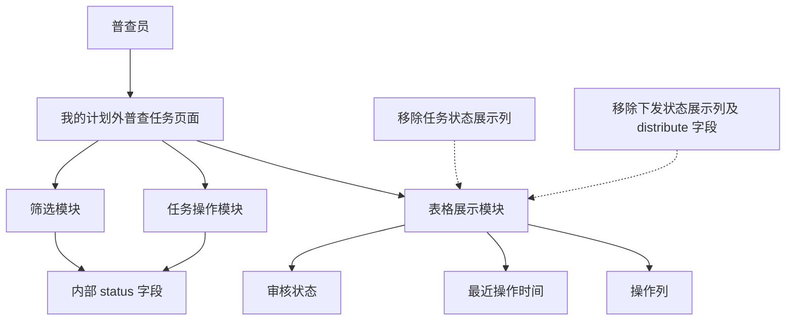
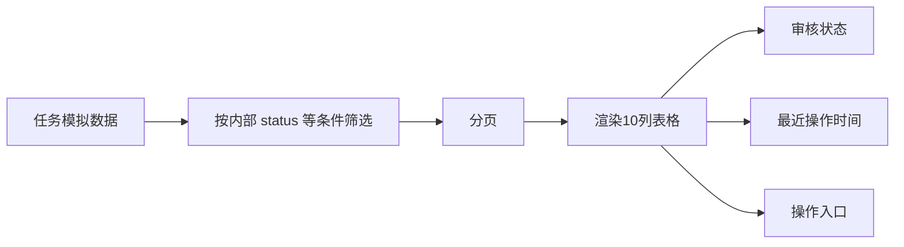

# 我的计划外普查任务列表字段精简 — 系统建设方案

> 版本：V1.0
> 日期：2026-07-22
> 状态：已实施，交互验收由用户执行
> 关联规格：`docs/我的计划外普查任务列表字段精简-功能规格说明书.md`

## 一、建设目标

在不改变现有业务交互和状态流转的前提下，精简普查员任务表格的状态展示，仅移除重复列及无效模拟字段，保证筛选、操作、分页和时间信息继续正常工作。

## 二、产品架构

## 三、模块划分

| 模块 | 调整内容 | 处理原则 |
|------|----------|----------|
| 表头 | 删除任务状态、下发状态两个 `<th>` | 其余列顺序不变 |
| 行渲染 | 删除对应两个 `<td>` | 保留审核状态、最近操作时间和操作 |
| 空状态 | `colspan` 从 12 调整为 10 | 与最终列数一致 |
| 数据模型 | 删除 `distribute` | 保留 `status`、`audit`、`lastOp` |
| 筛选模块 | 不调整任务状态筛选 | 继续读取 `status` |
| 操作模块 | 不调整操作判断和状态流转 | 继续使用内部 `status` |
| 文档 | 同步页面清单、字段字典和交互规则 | 标明“内部字段保留、列表列删除” |

## 四、核心交互逻辑

### 4.1 数据处理

### 4.2 字段保留策略

| 字段 | 是否保留 | 用途 |
|------|----------|------|
| `status` | 保留 | 任务状态筛选、操作按钮显示、上报及撤回流转 |
| `distribute` | 删除 | 原仅用于“下发状态”列展示，页面不再需要 |
| `audit` | 保留 | 审核状态列展示 |
| `lastOp` | 保留 | 最近操作时间列展示 |

## 五、Ant Design 组件选型说明

当前原型继续使用原生 HTML/CSS/JavaScript，实现语义对应以下 Ant Design 组件：

| 场景 | Ant Design 对应组件 | 本期处理 |
|------|---------------------|----------|
| 任务列表 | `Table` | 删除两个展示列配置 |
| 任务状态筛选 | `Select` | 保留，不受列删除影响 |
| 审核状态 | `Tag` | 保留现有标签展示 |
| 最近操作时间 | `Table.Column` | 保留现有展示或排序能力 |
| 分页 | `Pagination` | 保留现有规则 |
| 空数据 | `Empty` | 调整横跨列数 |

## 六、实施步骤

1. 检查 `distribute` 和 `status` 的全部引用。
2. 删除任务状态和下发状态表头。
3. 删除行渲染中对应两个单元格。
4. 删除所有任务模拟数据中的 `distribute` 属性。
5. 将空状态 `colspan` 调整为 10。
6. 保留 `status` 字段、任务状态筛选和操作流转逻辑。
7. 同步页面清单、字段字典和交互规则。
8. 执行脚本语法、列数、字段引用和差异格式检查。

## 七、验证方案

### 7.1 静态验证

- 页面内联 JavaScript 语法检查通过。
- 表头列数、行渲染单元格数和空状态 `colspan` 均为 10。
- 页面中不存在 `distribute` 字段引用。
- `status` 字段仍被筛选和操作逻辑正常引用。
- `git diff --check` 通过。

### 7.2 交互验收

- 页面不显示任务状态和下发状态列。
- 任务状态筛选仍能返回正确结果。
- 普查原因 Tab、日期筛选和分页不受影响。
- 填报、上报、撤回、查看入口保持原有行为。
- 空结果表格布局正常。

## 八、风险与控制

| 风险 | 控制措施 |
|------|----------|
| 误删 `status` 导致操作失效 | 仅删除展示单元格，保留数据字段与逻辑引用 |
| 删除列后空状态错位 | 同步调整 `colspan` 为 10 |
| `distribute` 存在隐藏依赖 | 实施前后全文件搜索引用 |
| 文档误写为删除任务状态能力 | 明确区分“删除展示列”和“保留内部状态字段” |

## 九、授权门禁

方案已于 2026-07-22 获得通过并完成页面实施。静态检查由实施方完成，浏览器交互验收由用户执行。
