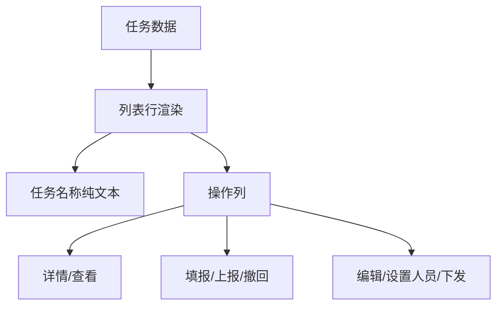

# 所有列表任务名称取消跳转 — 系统建设方案

> 版本：V1.0
> 日期：2026-07-22
> 状态：已实施，交互验收由用户执行
> 关联规格：`docs/所有列表任务名称取消跳转-功能规格说明书.md`

## 一、建设目标

以最小改动统一三个列表的任务名称渲染方式：名称只输出文本，所有业务跳转继续由操作列负责。保留现有数据、筛选、分页、排序、权限和详情路由逻辑。

## 二、产品架构

## 三、模块划分

| 文件 | 当前实现 | 调整方案 |
|------|----------|----------|
| `plan-outside-survey-task-list.html` | 任务名称为带 `<strong>` 的详情链接 | 移除 `<a>`，保留 `<strong>` 和文本转义 |
| `plan-outside-survey-task-items.html` | 趸售为文本，其他任务为详情链接 | 删除普查原因条件分支，统一输出普通任务名称文本 |
| `plan-outside-survey-task-worker.html` | 任务名称为 `href="#"` 的伪链接 | 移除 `<a>`，输出普通文本 |
| `docs/` | 部分文档仍描述点击任务名称进入详情 | 更新页面清单、交互规则及业务流程 |

## 四、核心实现逻辑

### 4.1 统一渲染边界

- 所有动态内容继续经过现有 `esc()` 转义函数。
- 任务名称模板只包含文本或保留现有的非交互加粗标签。
- 不为任务名称绑定 `data-*` 操作标识、事件代理或键盘交互。

### 4.2 操作列保持不变

- 任务管理列表：详情、编辑路由不变。
- 站点级任务列表：普通详情与趸售详情分流不变。
- 我的任务列表：趸售查看、各类型填报、上报和撤回逻辑不变。
- 本次不修改操作列权限和状态判断。

### 4.3 视觉处理

- `plan-outside-survey-task-list.html` 保留任务名称原有 `<strong>` 层级。
- 其他两个列表沿用当前文字字重，不额外统一加粗。
- 因不再使用 `.action-link`，自然移除蓝色、手型光标和悬停效果。
- 不新增 CSS 覆盖，避免影响操作列链接。

## 五、Ant Design 组件选型说明

当前原型使用原生 HTML/CSS/JavaScript，对应 Ant Design 语义如下：

| 场景 | Ant Design 对应 | 原型实现 |
|------|-----------------|----------|
| 任务名称 | `Typography.Text` | 普通文本/加粗文本 |
| 操作列 | `Table` render actions | 保留现有 `.action-row` 链接 |
| 详情跳转 | `Button type="link"` | 仅操作列保留链接样式 |

## 六、实施步骤

1. 修改任务管理列表的任务名称单元格，移除详情链接。
2. 修改站点级任务列表，删除趸售/非趸售名称交互分支。
3. 修改我的任务列表，移除任务名称伪链接。
4. 保持三个列表操作列代码和路由不变。
5. 同步页面清单、交互规则和业务流程。
6. 执行脚本语法、DOM 结构、任务名称模板和路由回归检查。

## 七、验证方案

### 7.1 静态验证

- 三个列表的任务名称模板不包含 `<a>` 或 `href`。
- 动态名称仍使用 `esc()` 转义。
- 操作列仍包含原有详情、查看、填报或编辑入口。
- 趸售详情仍携带正确 `id` 和 `source` 参数。
- 非趸售详情路由保持不变。
- 内联 JavaScript 语法正确。
- `git diff --check` 通过。

### 7.2 交互验收

- 三个列表的任务名称均无点击、手型光标和悬停效果。
- 操作列的所有现有动作仍可用。
- 趸售用户详情和普通任务详情分别进入正确页面。
- 筛选、排序和分页不受影响。
- 交互验收由用户执行。

## 八、风险与控制

| 风险 | 控制措施 |
|------|----------|
| 误删操作列详情路由 | 只修改任务名称单元格模板，单独检查操作列 |
| 动态名称失去转义 | 保留 `esc()` 调用 |
| 趸售路由分流被回退 | 保留现有 `detailHref` 和 `viewHref` 逻辑 |
| CSS 调整影响其他链接 | 不修改共享 `.action-link` 样式 |
| 文档继续描述名称可跳转 | 同步页面清单和交互规则 |

## 九、授权门禁

方案已于 2026-07-22 通过并完成实施；静态检查由 Codex 执行，页面交互验收由用户执行。
