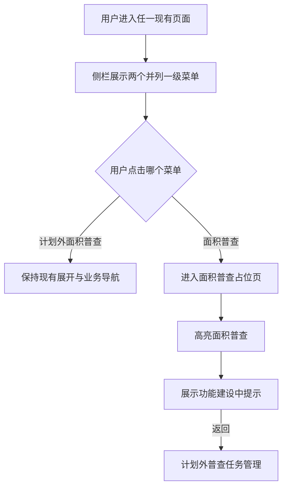

# 新增“面积普查”一级菜单 — 功能规格说明书

> 版本：V1.0
> 日期：2026-07-22
> 状态：方案已通过，已实施，交互验收通过

## 一、功能定义

在现有侧栏中保留一级菜单“计划外面积普查”，同时新增一个与其并列的一级菜单“面积普查”。“面积普查”本期不配置二级菜单，在所有现有页面、所有演示角色中显示；点击后进入独立的“面积普查功能建设中”占位页。

## 二、本期范围

- 新增一级菜单“面积普查”。
- 与“计划外面积普查”保持同级并列关系。
- 在所有现有页面及所有演示角色页面中显示。
- 新增独立占位页 `area-survey-placeholder.html`。
- 点击“面积普查”进入占位页。
- 占位页侧栏高亮“面积普查”，并保留“计划外面积普查”入口。
- 占位页展示功能建设中提示及返回“计划外普查任务管理”的入口。

## 三、不在本期范围

- 不新增“面积普查”二级菜单。
- 不建设年度计划、任务分发、普查填报、审核或统计功能。
- 不调整“计划外面积普查”现有二级菜单、权限和业务逻辑。
- 不增加后端接口或数据持久化。

## 四、角色与可见范围

| 演示角色 | 是否显示“面积普查” | 点击结果 |
|----------|--------------------|----------|
| 计划经营部/计划管理部 | 是 | 进入占位页 |
| 管理部审核人员 | 是 | 进入占位页 |
| 片区所人员 | 是 | 进入占位页 |
| 普查人员 | 是 | 进入占位页 |

## 五、菜单与页面规则

```text
侧栏
├─ 计划外面积普查
│  ├─ 计划外普查任务管理
│  ├─ 计划外普查任务
│  ├─ 我的计划外普查任务
│  └─ 计划外普查站点明细
└─ 面积普查
   └─ 本期无二级菜单，点击进入占位页
```

- “面积普查”使用与现有一级菜单一致的字号、字重、间距、图标占位和悬停样式。
- 在现有业务页面中，“计划外面积普查”及其当前二级菜单继续保持高亮规则；“面积普查”不高亮。
- 在占位页中，“面积普查”高亮；“计划外面积普查”不高亮。
- “面积普查”没有展开箭头，避免暗示本期存在二级菜单。

## 六、用户故事

### US-01 查看新一级菜单

作为任一系统用户，我希望在侧栏看到“面积普查”一级菜单，以便明确系统后续将承载年度面积普查能力。

```gherkin
场景: 在任一现有页面查看菜单
  假如 用户以任一演示角色进入系统现有页面
  那么 侧栏显示“计划外面积普查”
  并且 同级显示“面积普查”
  并且 “面积普查”下不显示二级菜单
```

### US-02 进入占位页

作为任一系统用户，我希望点击“面积普查”后看到明确的建设中说明，以免误以为点击无效。

```gherkin
场景: 点击面积普查
  当 用户点击一级菜单“面积普查”
  那么 系统进入面积普查占位页
  并且 侧栏“面积普查”显示选中态
  并且 页面提示“面积普查功能建设中”
```

### US-03 返回现有业务

```gherkin
场景: 从占位页返回
  假如 用户位于面积普查占位页
  当 用户点击“返回计划外普查任务管理”
  那么 系统进入计划外普查任务管理页面
```

## 七、业务流程



## 八、异常与边界

- 任一页面遗漏新菜单视为菜单一致性缺陷。
- 占位页文件不可访问时，不得使用空链接或 `#` 静默失败。
- 新菜单不得触发现有“计划外面积普查”的展开/收起事件。
- 页面宽度不足时，菜单文字保持单行，侧栏宽度沿用现有规范。

## 九、验收标准

- [ ] 所有现有HTML页面均显示“面积普查”一级菜单。
- [ ] 新菜单与“计划外面积普查”同级，视觉样式一致。
- [ ] 新菜单没有展开箭头和二级菜单。
- [ ] 点击后进入统一占位页。
- [ ] 占位页高亮正确，并可返回任务管理页。
- [ ] 原有菜单展开、当前项高亮和页面业务逻辑不受影响。
- [ ] 页面无JavaScript语法错误和控制台错误。

## 十、已确认事项

- 保留原一级菜单“计划外面积普查”。
- 新增并列一级菜单“面积普查”。
- 本期不生成二级菜单。
- 所有现有页面、所有演示角色均显示。
- 点击进入“面积普查功能建设中”占位页。
