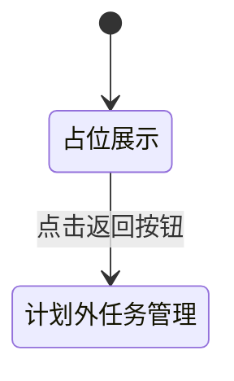

# 新增“面积普查”一级菜单 — 系统建设方案

> 版本：V1.0
> 日期：2026-07-22
> 状态：方案已通过，已实施，交互验收通过
> 关联规格：`docs/新增面积普查一级菜单-功能规格说明书.md`

## 一、建设目标

在不改变现有独立HTML原型架构和计划外普查业务逻辑的前提下，为所有页面补充并列一级菜单“面积普查”，并建设统一占位页，形成稳定、可扩展的后续年度面积普查入口。

## 二、产品架构


## 三、模块划分

| 模块 | 建设内容 | 影响范围 |
|------|----------|----------|
| 统一菜单 | 在现有菜单区末尾增加并列一级菜单 | 全部现有HTML页面 |
| 占位页面 | 建设标题、说明、状态图形和返回入口 | 新增 `area-survey-placeholder.html` |
| 高亮规则 | 现有页面不高亮新菜单，占位页高亮新菜单 | 页面菜单结构和样式 |
| 事件隔离 | 新菜单使用普通页面链接，不加入现有子菜单展开集合 | 页面JavaScript |
| 文档同步 | 更新页面清单和交互规则 | `docs/页面清单.md`、`docs/交互规则.md` |

## 四、菜单结构方案

现有侧栏以独立HTML片段分散在多个页面中，本期采用统一结构同步更新：

```html
<div class="menu-section">
  <a class="menu-item menu-parent" href="#">计划外面积普查 ...</a>
  <!-- 现有二级菜单 -->
  <a class="menu-item area-survey-entry" href="area-survey-placeholder.html">
    <span class="menu-icon">▣</span> 面积普查
  </a>
</div>
```

### 4.1 结构约束

- 新菜单必须位于现有计划外普查二级菜单之后。
- 不添加 `.menu-parent`、`.menu-child` 或 `.menu-arrow`，避免被现有展开脚本控制。
- 占位页的新菜单增加 `.active`；其他页面不增加 `.active`。
- 复用 `pc-template-base.css` 的 `.menu-item`、`.menu-icon` 和 `.active`，不重复定义菜单视觉样式。

## 五、占位页方案

### 5.1 页面结构

- 复用现有顶栏、侧栏、主内容区和面包屑。
- 页面标题：“面积普查”。
- 内容卡标题：“面积普查功能建设中”。
- 说明文案：“年度面积普查相关功能将在后续版本中逐步开放。”
- 提供“返回计划外普查任务管理”按钮。

### 5.2 页面状态



占位页不请求数据、不显示加载态、不设置定时器，也不模拟未确认业务能力。

## 六、核心交互逻辑

- 点击新菜单：浏览器跳转至 `area-survey-placeholder.html`。
- 点击现有“计划外面积普查”：继续执行原有展开/收起逻辑。
- 占位页点击返回按钮：跳转至 `plan-outside-survey-task-list.html`。
- 新菜单不参与 `document.querySelectorAll('.menu-child')` 的折叠集合。

## 七、Ant Design组件选型说明

当前原型使用原生HTML/CSS，视觉对应如下：

| 场景 | Ant Design组件 | 原型实现 |
|------|----------------|----------|
| 一级菜单 | `Menu.Item` | `.menu-item` + `.menu-icon` |
| 当前菜单 | `Menu.Item selectedKeys` | `.menu-item.active` |
| 占位内容 | `Result` | 卡片内图形、标题、说明和操作按钮 |
| 返回操作 | `Button type="primary"` | `.btn.primary` |
| 页面定位 | `Breadcrumb` | 现有 `.breadcrumb` |

## 八、页面覆盖范围

实施时通过文件扫描识别所有包含“计划外面积普查”侧栏的HTML页面，并逐一补充入口，至少覆盖：

- 任务管理、新建、编辑、任务站点、我的任务、站点明细和任务详情。
- 自管站、用户站、趸售用户相关填报与详情页面。
- 后续扫描发现的其他计划外普查页面。

不依赖手工列举作为唯一依据，避免遗漏页面。

## 九、实施步骤

1. 扫描全部HTML页面中的计划外普查侧栏结构。
2. 在每个现有页面加入并列一级菜单链接。
3. 新建统一占位页并设置菜单高亮。
4. 检查新菜单未被现有展开脚本误折叠。
5. 更新页面清单和交互规则。
6. 执行脚本解析、链接完整性和差异检查。
7. 浏览器验证菜单跳转、选中态、返回入口及不同角色页面的一致性。

## 十、验证方案

### 10.1 静态验证

- 扫描所有包含侧栏的HTML文件，确认新菜单链接数量符合预期。
- 校验 `area-survey-placeholder.html` 文件存在。
- 解析所有被修改页面的内联JavaScript。
- 执行 `git diff --check`。

### 10.2 浏览器验证

- 从计划经营部、片区所和普查员代表页面分别点击新菜单。
- 验证均进入同一占位页。
- 验证占位页只有“面积普查”高亮。
- 验证返回按钮进入计划外普查任务管理。
- 验证现有一级菜单仍可展开、收起，二级菜单未变化。
- 验证控制台无错误。

## 十一、风险与控制

| 风险 | 控制措施 |
|------|----------|
| 分散页面遗漏入口 | 使用文件扫描统计覆盖范围，不只人工逐页修改 |
| 新菜单被当作二级菜单折叠 | 不使用 `.menu-child` 类 |
| 新菜单触发现有展开事件 | 不使用 `.menu-parent` 类和箭头元素 |
| 占位页暗示未确认功能 | 只展示建设中说明，不罗列业务模块 |
| 当前菜单高亮冲突 | 每页只允许一个目标菜单拥有 `.active` |

## 十二、授权门禁

方案已于2026-07-22获得通过，并已按本方案完成原型实施；静态检查与浏览器交互验收均已通过。
