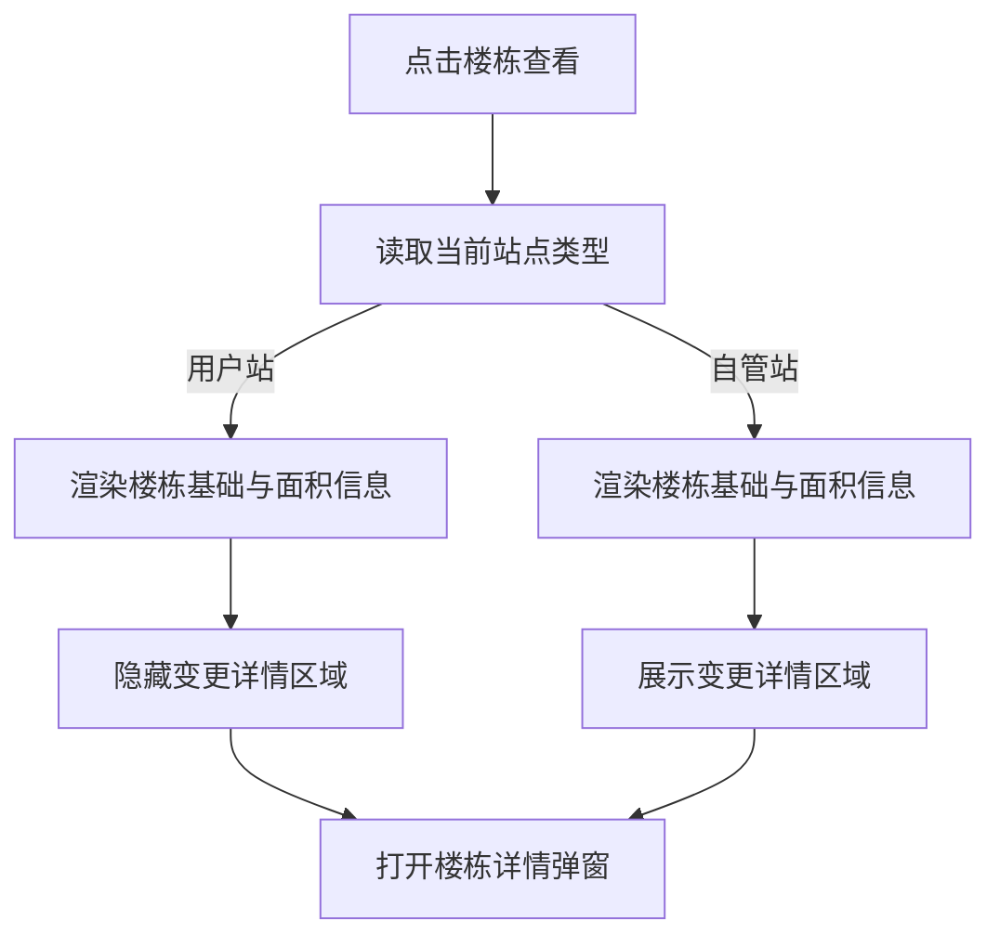
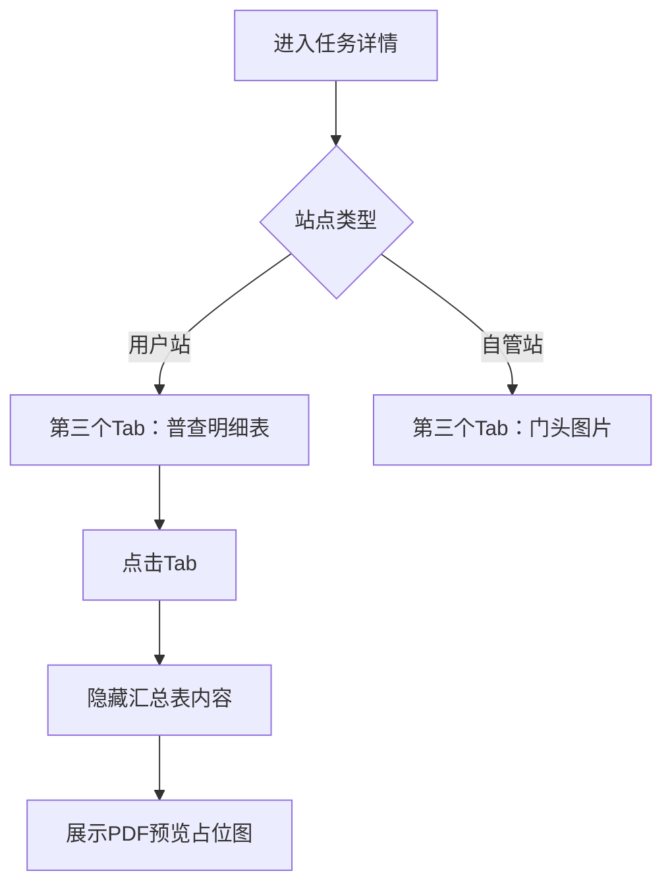

# 用户站详情差异化展示 — 功能规格说明书

> 版本：V1.0
> 日期：2026-07-22
> 状态：已实施，交互验收由用户执行
> 适用页面：`plan-outside-survey-task-detail.html`

## 一、功能定义

用户站不录入楼栋变更明细，也不上传门头图片。因此：用户站楼栋详情弹窗不展示“变更详情”标题和明细表；详情页第三个 Tab 由“门头图片”替换为“普查明细表”，点击后展示 PDF 预览占位。自管站继续展示完整变更详情和门头图片。

## 二、展示规则

| 站点类型 | 弹窗上方面积字段 | 变更详情标题及表格 | 外层楼栋列表面积列 |
|----------|------------------|--------------------|--------------------|
| 用户站 | 展示 | 隐藏 | 展示 |
| 自管站 | 展示 | 展示 | 展示 |

### 2.1 用户站隐藏范围

- 隐藏“变更详情”标题。
- 隐藏变更明细表，包括序号、热费卡号、普查面积、普查依据、附件和备注。
- 隐藏后弹窗内容区域自动收起，不保留空白占位。

### 2.2 保留内容

- 楼号和建筑物名称、层数、年代、用热性质、收费类别、控制方式、暖气类型。
- 原普查面积、现普查面积、现较原面积变化、变化率。
- 普查依据附件和备注。
- 外层楼栋列表中的原面积、现面积、变化和变化率列。

### 2.3 附件 Tab 差异

| 站点类型 | 第三个 Tab | 点击后内容 |
|----------|------------|------------|
| 用户站 | 普查明细表 | 展示已上传普查明细表的 PDF 预览占位图 |
| 自管站 | 门头图片 | 保持现有门头图片占位内容 |

- 用户站继续保留“汇总表”和“平面图”Tab。
- PDF 预览区展示文件名称 `用户站普查明细表.pdf`、PDF 类型标识及一张 A4 比例的预览占位图。
- 本期只做占位展示，不加载真实 PDF，不实现翻页、缩放、下载或打印。
- 切换回“汇总表”后恢复面积卡和楼栋列表。

## 三、用户故事

作为用户站任务查看人员，我希望楼栋详情不展示用户站不会录入的变更明细，以免误认为该区域需要填报，同时保留面积对比结果供查看。

## 四、业务流程





## 五、验收标准

```gherkin
场景: 查看用户站楼栋详情
  假如 当前任务站点类型为“用户站”
  当 用户打开任一楼栋详情
  那么 不显示“变更详情”标题和明细表
  并且 继续显示原面积、现面积、变化和变化率

场景: 查看自管站楼栋详情
  假如 当前任务站点类型为“自管站”
  当 用户打开任一楼栋详情
  那么 显示完整的变更详情标题和明细表

场景: 切换不同站点详情
  当 用户先查看用户站再查看自管站
  那么 变更详情区域按当前站点类型重新计算显隐
  并且 不沿用上一次弹窗状态

场景: 查看用户站普查明细表
  假如 当前任务站点类型为“用户站”
  当 用户点击“普查明细表”Tab
  那么 隐藏汇总表面积卡和楼栋列表
  并且 展示“用户站普查明细表.pdf”的PDF预览占位图

场景: 查看自管站附件Tab
  假如 当前任务站点类型为“自管站”
  那么 第三个Tab继续显示“门头图片”
```

## 六、异常与边界

- 站点类型缺失时按自管站兼容策略展示变更详情，避免误隐藏已有数据。
- 显隐判断只依赖当前详情页解析出的站点类型，不根据楼栋字段猜测。
- 本期不删除用户站模拟变更数据，仅控制界面不展示。
- PDF 预览为静态占位，不承诺文件可打开、下载或翻页。

## 七、确认状态

### 已确认

- 用户站仅隐藏楼栋详情弹窗底部变更详情区域。
- 弹窗上方面积字段继续展示。
- 外层楼栋列表面积字段继续展示。
- 自管站保持当前全部内容不变。
- 用户站第三个 Tab 改为“普查明细表”，展示 PDF 预览占位图。
- 用户站保留平面图，自管站保留门头图片。

### 待确认

- 无。
