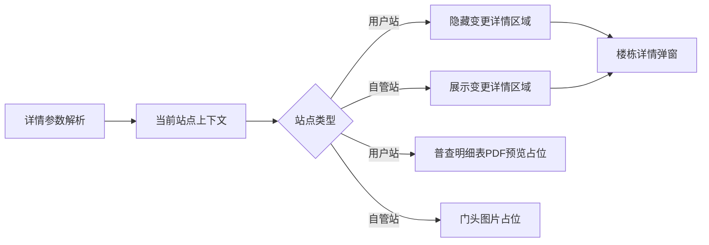

# 用户站详情差异化展示 — 系统建设方案

> 版本：V1.0
> 日期：2026-07-22
> 状态：已实施，交互验收由用户执行
> 关联规格：`docs/用户站楼栋详情隐藏变更明细-功能规格说明书.md`

## 一、建设目标

在现有任务详情页中加入基于站点类型的楼栋变更明细显隐和附件 Tab 差异化展示，不改变楼栋数据模型、面积展示和自管站业务内容。

## 二、产品架构

## 三、模块划分

| 模块 | 调整内容 | 影响位置 |
|------|----------|----------|
| 详情上下文 | 保存当前解析出的站点类型 | URL 与站点解析逻辑 |
| 弹窗结构 | 为变更详情标题和表格增加统一容器 | 楼栋详情弹窗 |
| 显隐逻辑 | 用户站隐藏、自管站显示 | `openBdDetail()` |
| 数据渲染 | 自管站继续生成变更明细 | `changeMock` 渲染 |
| Tab 标题 | 用户站显示普查明细表，自管站显示门头图片 | `reasonTabs` |
| Tab 内容 | 增加汇总、平面图、附件三个内容面板 | 详情主体卡片 |
| PDF 占位 | 构建静态A4比例预览图和文件信息 | 用户站附件面板 |
| 文档同步 | 更新页面清单、交互规则、字段说明 | `docs/` |

## 四、核心交互逻辑

### 4.1 当前站点上下文

- 页面初始化时通过现有 `resolveDetailContext()` 取得站点对象。
- 将当前站点类型保存为页面级变量，例如 `currentSiteType`。
- 未识别类型时默认按自管站处理。

### 4.2 弹窗显隐

- 为标题和明细表增加共同容器 `changeDetailSection`。
- 每次调用 `openBdDetail()` 时重新判断 `currentSiteType`。
- `用户站`：容器 `display:none`，不渲染可见明细。
- 其他类型：容器恢复显示并渲染现有 `changeMock`。
- 不修改上方面积字段及外层表格列。

### 4.3 Tab 内容切换

- 保存第三个 Tab 文案节点，页面初始化时按 `currentSiteType` 设置为“普查明细表”或“门头图片”。
- 将现有面积卡、楼栋表格和分页包装为“汇总表”内容面板。
- 新增“平面图”静态占位面板。
- 新增附件面板：用户站渲染 PDF 预览占位，自管站渲染门头图片占位。
- Tab 点击时只显示对应面板，不改变楼栋数据和统计结果。

### 4.4 PDF 预览占位

- 文件信息：`用户站普查明细表.pdf`、PDF 类型标识、已上传状态。
- 预览主体使用 A4 比例白色页面、灰色文本线和表格轮廓表达 PDF 页面。
- 明确标记“PDF 预览占位”，不嵌入真实 PDF viewer。

## 五、Ant Design 组件选型说明

当前原型继续使用原生 HTML/CSS/JavaScript，对应 Ant Design 语义如下：

| 场景 | Ant Design 对应方式 | 原型实现 |
|------|---------------------|----------|
| 楼栋详情 | `Modal` | 现有楼栋详情弹窗 |
| 条件展示 | 条件渲染 | 根据站点类型切换容器 `display` |
| 变更明细 | `Table` | 自管站保留现有变更表格 |
| 面积信息 | `Descriptions` | 两类站点均保留 |
| 普查明细表 | `Upload` + PDF Preview | 静态文件信息与A4预览占位 |

## 六、实施步骤

1. 为变更详情标题和表格增加统一容器 ID。
2. 保存当前详情站点类型。
3. 在楼栋详情打开函数中按站点类型切换容器显隐。
4. 保持面积字段和外层列表不变。
5. 增加三个 Tab 对应的内容面板与切换逻辑。
6. 按站点类型设置第三个 Tab 文案和附件占位内容。
7. 创建用户站普查明细表 PDF 预览占位图。
8. 同步页面清单、交互规则和字段字典。
9. 执行脚本语法、DOM 引用和站点类型分支检查。

## 七、验证方案

### 7.1 静态验证

- 内联 JavaScript 语法正确。
- `changeDetailSection` 唯一存在。
- 显隐判断明确使用 `currentSiteType === '用户站'`。
- 面积字段和外层表头未被删除。
- 用户站第三个 Tab 文案为“普查明细表”，自管站为“门头图片”。
- PDF 预览面板为静态占位，不包含外部文件依赖。
- `git diff --check` 通过。

### 7.2 交互验收

- 使用用户站参数打开详情，楼栋弹窗不显示变更详情区域。
- 用户站弹窗仍显示面积对比字段。
- 使用自管站参数打开详情，变更详情区域正常展示。
- 连续查看不同站点时显隐状态不串联。
- 用户站点击普查明细表后显示PDF预览占位，切回汇总表后恢复楼栋内容。
- 自管站第三个Tab仍展示门头图片占位。

## 八、风险与控制

| 风险 | 控制措施 |
|------|----------|
| 使用楼栋字段误判站点类型 | 只使用详情上下文中的站点类型 |
| 用户站隐藏后自管站无法恢复 | 每次打开弹窗重新设置 `display` |
| 隐藏标题但表格仍占位 | 使用统一父容器控制整个区域 |
| 误删面积字段 | 仅包裹变更标题和变更明细表 |
| Tab 只有高亮但内容未切换 | 为每个 Tab 建立独立面板并统一切换 |
| 占位图被误认为真实文件 | 明确显示“PDF 预览占位”标识 |

## 九、授权门禁

方案已于 2026-07-22 通过并完成页面实施；静态检查由 Codex 执行，页面交互验收由用户执行。
