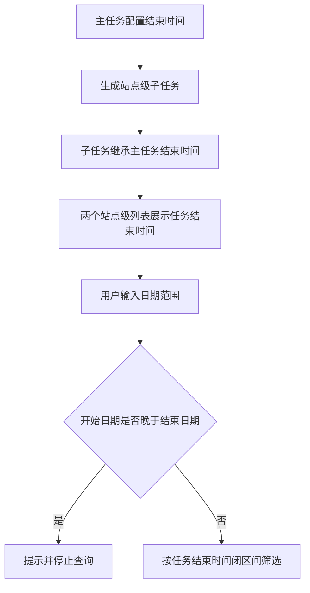

# 站点级子任务增加任务结束时间 — 功能规格说明书

> 版本：V1.0
> 日期：2026-07-22
> 状态：已实施，交互验收由用户执行
> 适用页面：计划外普查任务、我的计划外普查任务

## 一、功能定义

在两个站点级子任务列表中增加“任务结束时间”，帮助片区所人员和普查人员直接识别任务截止日期。子任务结束时间继承所属主任务结束时间，不允许在子任务层级单独维护；现有日期范围筛选改为按任务结束时间查询。

## 二、影响范围

| 列表 | 文件 | 新增字段位置 |
|------|------|--------------|
| 计划外普查任务 | `plan-outside-survey-task-items.html` | 最近操作时间之前 |
| 我的计划外普查任务 | `plan-outside-survey-task-worker.html` | 最近操作时间之前 |

## 三、用户故事

### User Story 001

- **Summary:** 在站点级列表直接查看任务截止日期

#### Use Case

- **As a** 片区所任务负责人或普查人员
- **I want to** 在每条站点级子任务中查看继承自主任务的结束时间
- **so that** 我能判断任务剩余处理周期并合理安排填报和审核工作

#### Acceptance Criteria

- **Scenario:** 展示站点级子任务结束时间
- **Given:** 主任务已配置结束时间
- **and Given:** 主任务下已生成站点级子任务
- **When:** 用户进入任一站点级子任务列表
- **Then:** 每条子任务在最近操作时间之前展示格式为 `YYYY-MM-DD` 的任务结束时间

### User Story 002

- **Summary:** 按任务截止日期范围定位子任务

#### Use Case

- **As a** 需要安排任务进度的业务人员
- **I want to** 按任务结束时间范围筛选站点级子任务
- **so that** 我能集中处理指定截止周期内的任务

#### Acceptance Criteria

- **Scenario:** 按任务结束时间范围筛选
- **Given:** 列表中存在不同任务结束日期的站点级子任务
- **and Given:** 用户填写开始时间和结束时间
- **When:** 用户点击查询
- **Then:** 列表只展示任务结束日期位于闭区间内的子任务

## 四、字段规则

| 字段 | 属性 | 规则 |
|------|------|------|
| 字段名 | `taskEndDate` | 站点级子任务展示字段 |
| 中文名 | 任务结束时间 | 表头文案 |
| 类型 | `date` | 不包含时分秒 |
| 格式 | `YYYY-MM-DD` | 例如 `2026-07-31` |
| 来源 | 所属主任务 `end` | 子任务继承，不可独立修改 |
| 空值 | `—` | 空值不命中日期筛选 |

主任务结束时间发生变更时，其所属全部站点级子任务应同步展示最新结束时间。当前静态原型通过模拟字段保持一致，正式系统由数据关联或接口返回保证。

## 五、列表与筛选规则

### 5.1 列表展示

- “任务结束时间”位于“最近操作时间”之前。
- 操作列继续固定在最右侧。
- 任务名称取消跳转的独立方案不受本字段影响。
- 本期不为任务结束时间增加表头排序。
- “计划外普查任务”继续支持按最近操作时间排序。

### 5.2 日期范围筛选

- 现有“开始时间”和“结束时间”控件含义统一改为任务结束日期范围。
- 开始时间：筛选 `taskEndDate >= 开始时间`。
- 结束时间：筛选 `taskEndDate <= 结束时间`。
- 同时填写时按闭区间筛选，包含两个边界日期。
- 仅填写开始时间时展示该日期及以后结束的任务。
- 仅填写结束时间时展示该日期及以前结束的任务。
- 开始时间晚于结束时间时不执行查询，并提示“开始时间不能晚于结束时间”。
- 重置后清空日期范围并恢复全部任务。

## 六、业务流程



## 七、异常与边界

- `taskEndDate` 缺失或格式非法时展示 `—`，并排除在日期范围筛选结果之外。
- 同一主任务下多个站点子任务的结束时间必须一致。
- 日期筛选不再按最近操作时间过滤；最近操作时间仅用于展示和现有排序。
- 分页处理顺序为：普查原因及其他条件筛选 → 任务结束时间筛选 → 最近操作时间排序 → 分页。
- 新增一列后继续使用表格横向滚动，不能挤压固定操作列。
- 字段为已存在主任务日期的投影，不增加额外数据请求和计算压力。

## 八、验收标准

```gherkin
场景: 两个站点级列表展示任务结束时间
  假如 子任务所属主任务结束时间为“2026-07-31”
  当 用户进入计划外普查任务或我的计划外普查任务
  那么 子任务的任务结束时间显示为“2026-07-31”
  并且 该列位于最近操作时间之前

场景: 继承主任务结束时间
  假如 同一主任务下存在多个站点级子任务
  当 主任务结束时间为“2026-08-20”
  那么 这些子任务均显示“2026-08-20”

场景: 使用日期闭区间筛选
  假如 用户输入开始时间“2026-07-20”和结束时间“2026-07-31”
  当 用户点击查询
  那么 只展示任务结束时间在“2026-07-20”至“2026-07-31”之间且包含边界的子任务

场景: 日期范围非法
  假如 开始时间晚于结束时间
  当 用户点击查询
  那么 页面提示“开始时间不能晚于结束时间”
  并且 不更新当前列表结果
```

## 九、确认状态

### 已确认

- 同时覆盖计划外普查任务和我的计划外普查任务。
- 子任务结束时间继承主任务，不允许单独修改。
- 展示格式为 `YYYY-MM-DD`。
- 新列位于最近操作时间之前，操作列保持最右固定。
- 现有日期范围筛选改为按任务结束时间筛选。

### 待确认

- 无。
