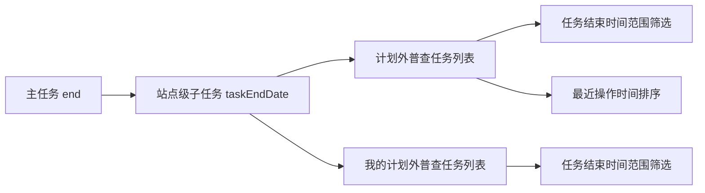

# 站点级子任务增加任务结束时间 — 系统建设方案

> 版本：V1.0
> 日期：2026-07-22
> 状态：已实施，交互验收由用户执行
> 关联规格：`docs/站点级子任务增加任务结束时间-功能规格说明书.md`

## 一、建设目标

在两个站点级子任务列表的数据模型、表格和筛选逻辑中增加主任务结束日期投影，以最小改动提供截止时间展示和范围查询，同时保持最近操作时间排序及现有操作路由不变。

## 二、产品架构



## 三、模块划分

| 模块 | 调整内容 | 文件 |
|------|----------|------|
| 子任务模拟数据 | 每条数据增加 `taskEndDate` | 两个站点级列表页 |
| 表格表头 | 最近操作时间前增加任务结束时间 | 两个站点级列表页 |
| 行渲染 | 输出 `taskEndDate`，空值为 `—` | 两个站点级列表页 |
| 日期筛选 | 从最近操作日期切换为 `taskEndDate` | 两个站点级列表页 |
| 日期校验 | 开始日期不得晚于结束日期 | 两个站点级列表页 |
| 空状态 | 调整新增列后的 `colspan` | 两个站点级列表页 |
| 文档 | 同步字段字典、交互规则、业务流程和页面清单 | `docs/` |

## 四、核心数据设计

### 4.1 字段映射

```text
Task.end -> TaskItem.taskEndDate
```

- 正式系统优先通过主任务关联实时读取，不建议在子任务表重复维护可编辑副本。
- 若接口直接返回 `taskEndDate`，后端必须保证与主任务 `end` 一致。
- 原型数据为每条子任务显式补充 `YYYY-MM-DD` 字符串。

### 4.2 演示数据

根据现有主任务结束日期，为站点级模拟任务补充合理的截止日期。同一任务名称或同一主任务来源的子任务使用相同日期；本次不修改主任务列表数据。

## 五、核心交互逻辑

### 5.1 日期校验

查询前执行：

```text
if start && end && start > end:
  提示“开始时间不能晚于结束时间”
  保持当前列表不变
```

### 5.2 筛选逻辑

将当前基于最近操作日期的判断：

```text
lastOperationTime.slice(0, 10)
```

替换为：

```text
taskEndDate
```

数据处理顺序保持为条件过滤后分页；“计划外普查任务”的最近操作时间排序继续在过滤之后、分页之前执行。

### 5.3 表格布局

- 在最近操作时间表头及单元格之前插入任务结束时间。
- 计划外普查任务空状态列数由 13 调整为 14。
- 我的计划外普查任务空状态列数由 10 调整为 11。
- 不改变操作列固定样式和现有表格最小宽度策略。

## 六、Ant Design 组件选型说明

当前原型使用原生 HTML/CSS/JavaScript，对应 Ant Design 语义如下：

| 场景 | Ant Design 对应 | 原型实现 |
|------|-----------------|----------|
| 日期范围 | `DatePicker.RangePicker` | 两个原生 `input[type=date]` |
| 任务结束时间 | `Table.Column` | 普通日期文本列 |
| 非法范围提示 | `message.error` | 原型使用 `alert()` 提示 |
| 最近操作排序 | `Table` sorter | 保留现有三态排序按钮 |

## 七、实施步骤

1. 为两个列表的模拟子任务增加 `taskEndDate`。
2. 在两个表格中增加任务结束时间表头和单元格。
3. 将日期筛选字段由最近操作日期改为任务结束日期。
4. 增加开始时间晚于结束时间的查询拦截。
5. 调整空状态 `colspan`。
6. 保留最近操作时间展示和原排序能力。
7. 同步文档并执行静态检查。

## 八、验证方案

### 8.1 静态验证

- 两个列表的每条模拟子任务均存在 `taskEndDate`。
- 日期格式满足 `/^\d{4}-\d{2}-\d{2}$/`。
- 表头和行单元格数量一致。
- 任务结束时间位于最近操作时间之前。
- 日期筛选明确读取 `taskEndDate`，不再读取 `lastOperationTime.slice(0, 10)`。
- 最近操作时间排序逻辑未删除。
- 空状态 `colspan` 与新增列数一致。
- 内联 JavaScript 语法及 `git diff --check` 通过。

### 8.2 交互验收

- 两个列表均显示任务结束时间。
- 仅开始日期、仅结束日期和完整闭区间筛选结果正确。
- 非法日期范围被拦截且列表保持原结果。
- 重置后日期条件清空。
- 最近操作时间排序继续有效。
- 操作列固定和横向滚动正常。
- 交互验收由用户执行。

## 九、风险与控制

| 风险 | 控制措施 |
|------|----------|
| 子任务日期与主任务不一致 | 正式系统通过主任务关联读取或后端统一投影 |
| 日期控件含义与字段不一致 | 文档和代码统一改为任务结束时间范围 |
| 误删最近操作排序 | 仅替换筛选字段，保留排序函数 |
| 新列导致操作列错位 | 同步表头、行和空状态列数并检查固定列 |
| 非法日期范围返回空列表 | 查询前拦截并保持当前结果 |

## 十、授权门禁

方案已于 2026-07-22 通过并完成实施；静态检查由 Codex 执行，页面交互验收由用户执行。
