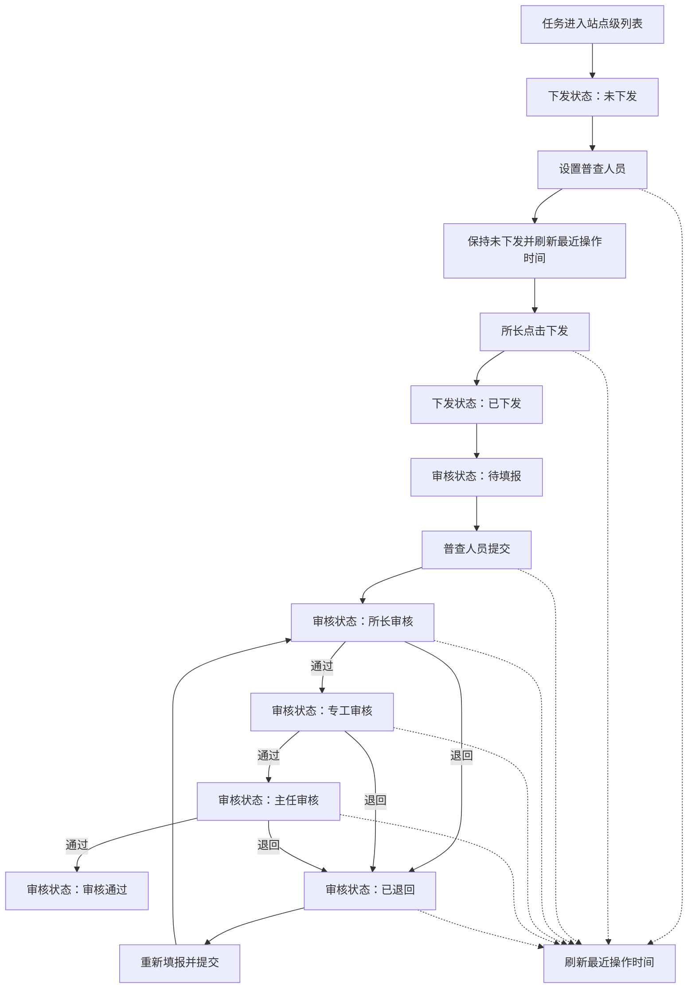

# 计划外普查任务列表状态字段扩展 — 功能规格说明书

> 版本：V1.0
> 日期：2026-07-22
> 状态：已实施，交互验收由用户执行
> 适用页面：`plan-outside-survey-task-items.html`

## 一、功能定义

在“计划外普查任务”站点级列表中，将原“任务状态”拆分为相互独立的“下发状态”和“审核状态”，同时增加“最近操作时间”。筛选区同步以“下发状态”“审核状态”取代原“任务状态”，列表支持按最近操作时间排序。

### 1.1 本期范围

- 表格新增“下发状态”“审核状态”“最近操作时间”三列。
- 删除表格及筛选区对原“任务状态”的展示与筛选依赖。
- 筛选区新增“下发状态”“审核状态”两个筛选项。
- 最近操作时间支持升序、降序排序。
- 分配、下发、填报、审核、退回操作均刷新最近操作时间。
- 保留现有任务名称、站点、普查原因、组织、普查人员和操作列。

### 1.2 不在本期范围

- 不新增后端接口、数据库或真实持久化能力。
- 不调整审核角色权限和退回目标规则。
- 不改变现有分页条数、普查原因 Tab 和详情页结构。
- 不实现跨页面数据持久化；原型以内存模拟数据演示状态变化。

## 二、字段定义

| 字段 | 类型 | 枚举/格式 | 展示规则 |
|------|------|-----------|----------|
| 下发状态 | 枚举 | 未下发、已下发 | 设置普查人员后仍为“未下发”；成功点击“下发”后变为“已下发” |
| 审核状态 | 枚举 | 待填报、所长审核、专工审核、主任审核、审核通过、已退回 | 独立描述任务所处的填报或审核节点 |
| 最近操作时间 | 日期时间 | `YYYY-MM-DD HH:mm` | 展示该站点任务最后一次分配、下发、填报、审核或退回的时间 |

### 2.1 状态关系

- “下发状态”只描述任务是否已正式下发，不再承担审核进度含义。
- “审核状态”只描述填报及审核进度，不再承担是否已下发的含义。
- 未下发任务默认审核状态为“待填报”，但在下发前不可进入审核节点。
- “已退回”表示最近一次审核动作是退回；重新提交后进入对应审核节点。
- 原“任务状态”字段停止在本页展示和筛选，不与新增字段并列保留。

## 三、用户故事

### US-01 查看任务状态

作为片区所长或管理人员，我希望分别看到任务是否已下发、当前审核进度以及最近操作时间，以便快速判断任务卡在哪个业务环节。

**验收标准：**

```gherkin
场景: 查看未下发任务
  假如 某任务已经设置普查人员但尚未执行下发
  当 用户查看计划外普查任务列表
  那么 下发状态显示“未下发”
  并且 审核状态显示“待填报”

场景: 查看审核中的任务
  假如 某任务已经下发且进入专工审核
  当 用户查看计划外普查任务列表
  那么 下发状态显示“已下发”
  并且 审核状态显示“专工审核”
```

### US-02 按状态组合筛选

作为管理人员，我希望能够组合筛选下发状态和审核状态，以便定位未下发任务或特定审核节点的任务。

**验收标准：**

```gherkin
场景: 组合筛选
  假如 列表中存在不同下发状态和审核状态的任务
  当 用户选择“已下发”和“所长审核”并执行查询
  那么 列表仅展示同时满足两个条件的任务

场景: 重置筛选
  当 用户点击“重置”
  那么 下发状态和审核状态恢复为“全部”
  并且 其他筛选条件一并恢复默认值
```

### US-03 按最近操作时间排序

作为管理人员，我希望按最近操作时间升序或降序排列任务，以便优先处理最新变化或长期未处理的任务。

**验收标准：**

```gherkin
场景: 降序排序
  当 用户将最近操作时间切换为降序
  那么 最近发生操作的任务排在最前

场景: 升序排序
  当 用户将最近操作时间切换为升序
  那么 最早发生操作的任务排在最前

场景: 操作后更新时间
  当 用户成功执行分配、下发、填报、审核或退回操作
  那么 该任务的最近操作时间更新为操作发生时间
```

## 四、业务流程



## 五、交互规则

### 5.1 筛选

- 下发状态：下拉单选，选项为“全部 / 未下发 / 已下发”。
- 审核状态：下拉单选，选项为“全部 / 待填报 / 所长审核 / 专工审核 / 主任审核 / 审核通过 / 已退回”。
- 两个状态条件与站点编码、站点名称、站点类型、普查原因 Tab 采用 AND 关系组合筛选。
- 点击“查询”后从第一页展示结果；点击“重置”恢复全部条件并回到第一页。

### 5.2 排序

- 最近操作时间表头提供排序入口，支持未排序、升序、降序三种状态。
- 首次点击按降序排列，再次点击切换为升序，再次点击恢复默认顺序。
- 排序作用于筛选后的完整结果集，先排序再分页。
- 默认顺序沿用现有模拟数据顺序，不自动按时间重排。

### 5.3 异常与边界

- 最近操作时间缺失时显示“—”，排序时统一置于有值记录之后。
- 下发失败时不得改变下发状态，也不得刷新最近操作时间。
- 未设置普查人员时不允许下发，沿用现有操作限制。
- 未下发任务不得显示为所长审核、专工审核、主任审核或审核通过。

## 六、验收清单

- [ ] 原“任务状态”筛选项已被两个新筛选项取代。
- [ ] 表格正确展示三个新增字段。
- [ ] 下发前后状态变化符合定义。
- [ ] 所有审核状态均有明确、统一的标签样式。
- [ ] 组合筛选结果正确，重置行为正确。
- [ ] 时间升降序、恢复默认顺序和分页组合正确。
- [ ] 最近操作时间按分钟展示，缺失值显示“—”。
- [ ] 页面无 JavaScript 语法错误，现有分配、下发、详情入口不受影响。

## 七、确认状态

### 已确认

- 下发状态采用“未下发 / 已下发”。
- 设置普查人员不等同于下发，点击“下发”后才变为“已下发”。
- 审核状态采用“待填报 / 所长审核 / 专工审核 / 主任审核 / 审核通过 / 已退回”。
- 新增两类状态取代本页原“任务状态”。
- 最近操作时间覆盖分配、下发、填报、审核和退回，并展示到分钟。
- 同时增加两个状态筛选项，最近操作时间支持排序。

### 待确认

- 无。页面已按本规格实施，浏览器交互验收由用户执行。
