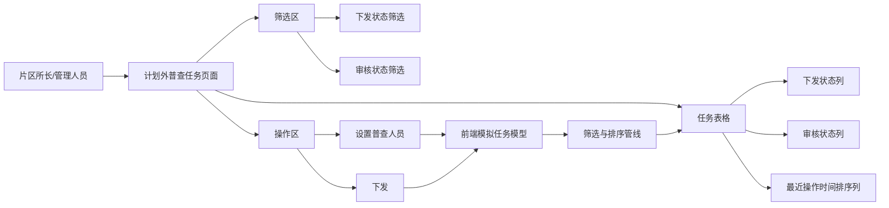

# 计划外普查任务列表状态字段扩展 — 系统建设方案

> 版本：V1.0
> 日期：2026-07-22
> 状态：已实施，交互验收由用户执行
> 关联规格：`docs/计划外普查任务列表状态字段扩展-功能规格说明书.md`

## 一、建设目标

在不改变现有单文件 HTML 原型架构的前提下，为“计划外普查任务”站点级列表建立独立的下发状态、审核状态和最近操作时间模型，并完成筛选、排序、分页及操作后的联动展示。

## 二、产品架构



## 三、模块划分

| 模块 | 建设内容 | 影响位置 |
|------|----------|----------|
| 数据模型 | 用 `dispatchStatus`、`auditStatus`、`lastOperationTime` 取代本页原 `status` 的展示和筛选职责 | 页面内模拟任务数组 |
| 筛选模块 | 新增两个状态下拉框，移除原任务状态筛选 | 筛选卡片、查询与重置逻辑 |
| 排序模块 | 增加时间排序状态与比较逻辑 | 最近操作时间表头、数据处理函数 |
| 表格模块 | 新增三列及状态标签渲染 | 表头、行渲染模板 |
| 操作联动 | 分配和下发成功后更新对应字段及时间 | 设置人员弹窗、下发确认逻辑 |
| 样式模块 | 增加状态标签及可排序表头样式 | 页面局部样式；公共样式仅在确有复用价值时调整 |
| 文档同步 | 更新页面清单、字段字典、交互规则和业务流程中的相关定义 | `docs/` 现有文档 |

## 四、数据模型设计

每条站点级任务增加以下字段：

```js
{
  dispatchStatus: '未下发',
  auditStatus: '待填报',
  lastOperationTime: '2026-07-22 14:30'
}
```

### 4.1 字段约束

- `dispatchStatus`：仅允许 `未下发`、`已下发`。
- `auditStatus`：仅允许 `待填报`、`所长审核`、`专工审核`、`主任审核`、`审核通过`、`已退回`。
- `lastOperationTime`：原型使用可稳定解析和展示的日期时间字符串；比较时统一转换为时间戳。
- 原 `status` 不再参与本页面筛选、列表展示和下发按钮显隐判断；完成迁移后删除无效依赖，避免双状态源冲突。

### 4.2 原数据迁移映射

| 当前数据特征 | 下发状态 | 审核状态 |
|--------------|----------|----------|
| 普查人员为“待分配” | 未下发 | 待填报 |
| 已选择普查人员但尚未点击下发 | 未下发 | 待填报 |
| 已执行下发 | 已下发 | 待填报 |
| 已进入任一审核节点 | 已下发 | 对应审核状态 |

## 五、核心交互逻辑

### 5.1 数据处理顺序


### 5.2 查询与重置

- 查询时读取全部筛选控件，两个新增状态筛选与既有条件组合过滤。
- 查询后将当前页重置为第 1 页，防止筛选后出现空白页。
- 重置时清空所有筛选值、清除时间排序状态并恢复原始顺序。

### 5.3 排序

- 页面维护 `timeSortDirection`，值为 `null`、`desc` 或 `asc`。
- 使用数组副本排序，避免直接改变原始任务数据顺序。
- 有效时间按时间戳比较；无值记录无论升降序均置后。
- 排序后再分页，保证跨页顺序正确。

### 5.4 操作联动

- 设置普查人员成功：更新 `worker`，保持 `dispatchStatus = 未下发`，刷新 `lastOperationTime`。
- 点击下发成功：更新 `dispatchStatus = 已下发`、`auditStatus = 待填报`，刷新 `lastOperationTime`，隐藏或禁用下发操作。
- 下发按钮显隐依据：已设置普查人员且 `dispatchStatus === 未下发`。
- 当前页面尚无真实填报和审核操作；先准备完整枚举模拟数据，后续相关页面接入时按同一字段更新。

## 六、Ant Design 组件选型说明

当前原型为原生 HTML/CSS/JavaScript，不直接引入 Ant Design 依赖；实现形态对齐以下组件规范：

| 场景 | Ant Design 对应组件 | 原型实现建议 |
|------|---------------------|--------------|
| 状态筛选 | `Select` | 使用现有 `.select`，单选、可恢复“全部” |
| 状态展示 | `Tag` | 使用紧凑圆角标签，不只依赖颜色区分 |
| 时间排序 | `Table.Column.sorter` | 表头增加双向排序图标与激活态 |
| 下发确认 | `Modal.confirm` | 沿用现有确认弹窗交互 |
| 操作反馈 | `message.success/error` | 原型沿用现有消息提示组件或轻量提示 |
| 空数据 | `Empty` | 沿用表格空状态，列数同步更新 |
| 分页 | `Pagination` | 保持现有 10 条/页规则 |

### 6.1 状态标签建议

- 未下发、待填报：中性灰。
- 已下发：蓝色。
- 所长审核、专工审核：橙色。
- 主任审核：蓝紫色或主色。
- 审核通过：绿色。
- 已退回：红色。

标签必须同时展示文字，颜色仅作为辅助识别。

## 七、页面布局调整

- 筛选区以现有栅格密度增加两个下拉项，并移除原任务状态项，避免无效重复。
- 表格增加三列后保留横向滚动能力，操作列固定在最右侧的视觉位置。
- 最近操作时间建议最小宽度 150px，状态列建议最小宽度 90–110px，表头不换行。
- 空状态单元格 `colspan` 随最终列数同步调整。

## 八、实施步骤

1. 更新页面模拟数据结构并迁移现有样例数据。
2. 替换筛选控件与筛选逻辑。
3. 扩展表头、行渲染、空状态列数与标签样式。
4. 实现最近操作时间三态排序，并接入筛选后、分页前的数据管线。
5. 改造设置人员和下发逻辑，使状态与时间同步更新。
6. 同步页面清单、字段字典、交互规则和业务流程文档。
7. 执行静态语法检查、`git diff --check` 和浏览器交互验证。

## 九、验证方案

### 9.1 静态验证

- 提取内联 JavaScript 并执行语法检查。
- 检查旧 `status` 筛选和显隐依赖是否已清除。
- 执行 `git diff --check`。

### 9.2 交互验证

- 分别验证两个新增状态筛选，并验证组合查询。
- 验证重置后条件、排序和分页均恢复默认状态。
- 验证时间降序、升序、恢复默认顺序三态切换。
- 验证设置人员后仍未下发，且时间刷新。
- 验证下发后状态变为已下发、审核状态为待填报，且时间刷新。
- 验证筛选、排序、分页叠加时结果正确。
- 验证详情入口和既有普查原因 Tab 无回归。

## 十、风险与控制

| 风险 | 控制措施 |
|------|----------|
| 原 `status` 与新状态并存导致判断冲突 | 完成页面内依赖迁移，单一字段只表达单一业务维度 |
| 日期字符串解析不一致 | 使用固定格式并在排序函数中显式转换 |
| 新增列导致操作列被挤压 | 设置列宽并保留横向滚动 |
| 排序只作用于当前页 | 严格执行“筛选 → 排序 → 分页”顺序 |
| 操作后筛选结果变化 | 更新数据后重新执行完整渲染管线，并合理处理当前页 |

## 十一、授权门禁

方案已于 2026-07-22 获得通过并完成页面实施。静态检查由实施方完成，浏览器交互验收由用户执行。
