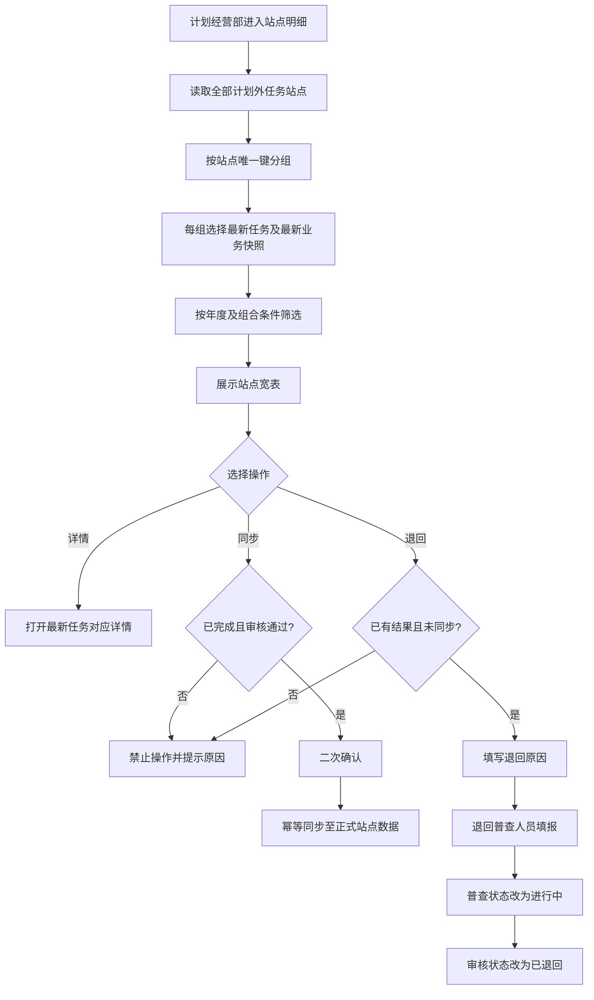

# 计划外普查站点明细 — 功能规格说明书

> 版本：V1.0
> 日期：2026-07-22
> 状态：方案已通过，已实施，交互验收通过
> 适用角色：计划经营部
> 计划页面：`plan-outside-survey-site-details.html`

## 一、功能定义

在“计划外面积普查”一级菜单下新增第四个二级菜单“计划外普查站点明细”，汇总展示全部计划外普查任务涉及的站点。页面按换热站唯一标识去重，每个站点只展示一行，以该站点最新任务及其最新普查结果为准，供计划经营部集中查询站点进度、审核进度、面积变化，并执行详情、同步和退回操作。

### 1.1 业务目标

- 将分散在不同计划外普查任务中的站点结果汇总到统一视图。
- 避免同一站点因重复进入计划外任务而产生多行干扰。
- 同时呈现普查状态、下发状态和审核状态，区分执行、分发与审核三个业务维度。
- 为计划经营部提供结果核查、正式数据同步和异常退回入口。

### 1.2 用户痛点

- 当前任务列表以任务或任务站点为粒度，无法快速查看站点的最新普查结果。
- 同一站点进入多个任务时，用户需要逐任务比较才能判断哪条数据有效。
- 面积变化字段分散在详情中，难以进行跨站点查询。
- 缺少统一的同步和退回处理入口。

### 1.3 本期范围

- 新增“计划外普查站点明细”菜单及独立列表页。
- 仅计划经营部角色显示并可访问该菜单和页面。
- 汇总全部计划外普查任务中的站点，不按任务状态排除数据。
- 按站点去重，以最新任务记录及其最新普查结果展示一行。
- 支持截图字段以及下发状态、审核状态的组合筛选。
- 展示用户指定的 20 个业务字段及操作列。
- 操作列提供“详情”“同步”“退回”三个按钮。
- 保留宽表横向滚动和右侧操作列固定能力。

### 1.4 不在本期范围

- 不增加管理部、片区所或普查员对本页面的访问权限。
- 不提供批量同步、批量退回、导出或自定义列能力。
- 不改变现有计划外任务的创建、分配、填报和三级审核流程。
- 原型阶段不建设真实后端接口、数据库事务和权限服务。

## 二、角色与权限

| 角色 | 菜单可见 | 页面访问 | 详情 | 同步 | 退回 |
|------|----------|----------|------|------|------|
| 计划经营部 | 是 | 是 | 是 | 是，受状态约束 | 是，受状态约束 |
| 管理部 | 否 | 否 | 否 | 否 | 否 |
| 片区所 | 否 | 否 | 否 | 否 | 否 |
| 普查人员 | 否 | 否 | 否 | 否 | 否 |

正式系统除隐藏菜单外，还必须校验页面路由和操作权限；无权限访问时返回无权限提示，不得仅依赖前端隐藏。

## 三、数据范围与去重规则

### 3.1 数据范围

- 纳入全部计划外普查任务中的站点，包括未下发、已下发、未开始、进行中、已完成、审核中、审核通过和已退回的数据。
- 正式站点以换热站编码作为唯一键。
- 临时站点无正式编码时，以临时站点 ID 作为唯一键；编码列显示“—”。

### 3.2 最新记录判定

同一站点存在多条计划外任务记录时，仅保留一条：

1. 优先取任务创建时间最新的记录。
2. 创建时间相同则取任务编号排序最新的记录。
3. 该行的普查结果、状态、人员和完成时间均来自入选任务站点的最新业务快照，不拼接不同任务的数据。

> 说明：该规则把“最新任务”和“最新普查结果”绑定在同一条任务站点记录上，避免把旧任务结果错误拼接到新任务状态中。

## 四、字段定义

### 4.1 列表字段

| 序号 | 字段 | 格式/枚举 | 展示规则 |
|------|------|-----------|----------|
| 1 | 序号 | 正整数 | 按当前筛选、排序、分页结果动态生成 |
| 2 | 换热站编码 | 文本 | 临时站点无编码时显示“—” |
| 3 | 换热站名称 | 文本 | 展示最新任务中的站点名称 |
| 4 | 普查状态 | 未开始 / 进行中 / 已完成 | 见 4.2 |
| 5 | 下发状态 | 未下发 / 已下发 | 与审核状态相互独立 |
| 6 | 审核状态 | 待填报 / 所长审核 / 专工审核 / 主任审核 / 审核通过 / 已退回 | 与现有站点级任务规则一致 |
| 7 | 管理部 | 文本 | 站点归属管理部 |
| 8 | 片区所 | 文本 | 站点归属片区所 |
| 9 | 站点类型 | 用户站 / 自管站 | 沿用现有枚举 |
| 10 | 办事处 | 文本 | 无值显示“—” |
| 11 | 用热地址 | 文本 | 超长文本单行省略，悬停查看完整内容 |
| 12 | 建筑年代 | 年份 | 无值显示“—” |
| 13 | 原面积（m²） | 数值 | 保留 3 位小数；未产生有效结果时显示“—” |
| 14 | 现面积（m²） | 数值 | 保留 3 位小数；未产生有效结果时显示“—” |
| 15 | 面积变化率 | 百分比 | `(现面积－原面积) / 原面积 × 100%`；原面积为 0 或无结果时显示“—” |
| 16 | 是否有面积变化 | 是 / 否 / — | 比较保留 3 位小数后的原、现面积；无有效结果时显示“—” |
| 17 | 居民面积变化（m²） | 数值 | 现居民面积－原居民面积，保留 3 位小数 |
| 18 | 非居民面积变化（m²） | 数值 | 现非居民面积－原非居民面积，保留 3 位小数 |
| 19 | 普查人员 | 文本 | 未分配时显示“待分配” |
| 20 | 普查完成时间 | `YYYY-MM-DD HH:mm` | 未完成或退回后待重新填报时显示“—” |
| 21 | 操作 | 按钮组 | 详情 / 同步 / 退回 |

### 4.2 普查状态口径

| 普查状态 | 判定规则 |
|----------|----------|
| 未开始 | 任务站点未下发，或已下发但普查人员尚未开始填报 |
| 进行中 | 普查人员已经开始填报但尚未提交有效普查结果，或结果被退回后正在修改 |
| 已完成 | 普查人员已提交完整普查结果并生成普查完成时间；审核状态可处于审核中、审核通过或已退回历史状态 |

当结果被退回且需要重新填报时，当前普查状态恢复为“进行中”，原完成时间作为历史记录保留，但本列表“普查完成时间”显示“—”，重新提交后写入新的完成时间。

### 4.3 面积口径

- 原面积、现面积均采用站点最新普查结果中的站点总面积。
- 居民面积变化 = 最新现居民面积－最新原居民面积。
- 非居民面积变化 = 最新现非居民面积－最新原非居民面积。
- 面积值计算及“是否有面积变化”判断统一先四舍五入至 3 位小数。
- 面积变化率可为正数、负数或 0；列表建议保留 2 位百分数小数。

## 五、筛选条件

筛选区基于用户截图，并增加下发状态和审核状态：

| 筛选项 | 控件 | 默认值 | 匹配规则 |
|--------|------|--------|----------|
| 普查年度 | Select，必填 | 当前年度 2026 年 | 按最新任务的普查年度精确匹配 |
| 换热站编码 | Input | 空 | 包含匹配，忽略大小写 |
| 换热站名称 | Input | 空 | 模糊匹配 |
| 普查状态 | Select | 全部 | 精确匹配 |
| 下发状态 | Select | 全部 | 精确匹配 |
| 审核状态 | Select | 全部 | 精确匹配 |
| 站点类型 | Select | 全部 | 精确匹配 |
| 是否有面积变化 | Select | 全部 | 全部 / 是 / 否；“—”不命中是或否 |
| 建筑年代 | 年份区间 | 空 | 起始年 ≤ 建筑年代 ≤ 结束年 |
| 普查完成时间 | DatePicker.RangePicker | 空 | 闭区间匹配，包含起止日期全天 |

### 5.1 筛选交互

- 所有非空条件采用 AND 关系组合。
- 点击“查询”后回到第 1 页并渲染结果。
- 点击“重置”后，仅保留“普查年度 = 当前年度”，其余恢复默认值并回到第 1 页。
- 起始年份大于结束年份、开始日期晚于结束日期时，阻止查询并给出字段级提示。
- 无结果时展示“暂无符合条件的计划外普查站点”。

## 六、用户故事与验收标准

### US-01 查看最新站点结果

作为计划经营部人员，我希望每个站点只显示最新任务的一条记录，以便直接判断当前有效结果。

```gherkin
场景: 同一站点存在多个计划外任务
  假如 同一换热站先后进入两个计划外普查任务
  当 用户进入计划外普查站点明细
  那么 该换热站只展示一行
  并且 该行的状态、面积结果、人员和完成时间均来自最新任务记录
```

### US-02 组合筛选站点

作为计划经营部人员，我希望按年度、站点、状态、类型、年代和完成时间组合筛选，以便快速定位目标站点。

```gherkin
场景: 筛选已完成且有面积变化的站点
  假如 当前年度存在不同普查状态和面积变化情况的站点
  当 用户选择普查状态“已完成”且是否有面积变化“是”并点击查询
  那么 列表只展示同时满足两个条件的最新站点记录

场景: 重置筛选
  当 用户点击重置
  那么 普查年度恢复为当前年度
  并且 其余筛选项恢复为全部或空
```

### US-03 查看站点详情

作为计划经营部人员，我希望从汇总列表进入站点对应的最新任务详情，以便核查完整普查和审批信息。

```gherkin
场景: 打开详情
  当 用户点击某行“详情”
  那么 系统打开该站点最新任务对应的详情页
  并且 详情页能够返回计划外普查站点明细且保留原查询条件
```

### US-04 同步审核通过的结果

作为计划经营部人员，我希望将审核通过的最新普查结果同步到正式站点数据，以便业务系统使用已确认面积。

```gherkin
场景: 同步有效结果
  假如 站点普查状态为“已完成”且审核状态为“审核通过”
  当 用户点击同步并确认
  那么 系统将该任务站点的最新有效结果同步到正式站点数据
  并且 重复点击同步不会重复累计面积

场景: 阻止同步未通过结果
  假如 站点尚未完成或审核状态不是“审核通过”
  那么 同步按钮不可用
```

### US-05 退回异常结果

作为计划经营部人员，我希望将未同步且存在问题的结果退回普查人员修改，以便修正后重新提交审核。

```gherkin
场景: 退回站点结果
  假如 站点已有普查结果且尚未同步正式数据
  当 用户点击退回、填写退回原因并确认
  那么 审核状态更新为“已退回”
  并且 普查状态更新为“进行中”
  并且 该站点重新进入普查人员填报环节

场景: 阻止退回已同步结果
  假如 站点结果已经同步到正式数据
  那么 退回按钮不可用
```

## 七、业务流程



## 八、操作规则

| 操作 | 可用条件 | 交互结果 |
|------|----------|----------|
| 详情 | 所有行 | 打开最新任务对应详情页 |
| 同步 | 普查状态=已完成、审核状态=审核通过、存在有效结果 | 二次确认后幂等写入正式站点数据；成功后提示 |
| 退回 | 已产生普查结果且尚未完成同步 | 弹窗填写必填退回原因，确认后退回普查人员填报 |

- 操作执行期间按钮进入加载状态，防止重复提交。
- 操作失败不得改变列表状态，并展示明确失败原因。
- 同步必须进行版本校验；若列表记录已被更新，提示刷新后重试。
- 退回原因去除首尾空格后必填，建议最多 300 字。

## 九、性能与异常约束

- 正式系统的去重、筛选、排序和分页应由服务端完成，禁止先拉取全量数据再在浏览器去重。
- 目标：普通查询在 2 秒内返回；同步、退回在 3 秒内返回明确结果。
- 站点唯一键、任务创建时间、普查年度、三类状态、站点类型、完成时间应建立适用索引。
- 数据缺失时按字段规则显示“—”，不得导致整行无法展示。
- 同步采用幂等键和事务处理，避免重复写入或部分字段成功。
- 退回与同步并发时以服务端最新版本为准，只允许一个操作成功。

## 十、确认状态

### 已确认

- 新菜单名称为“计划外普查站点明细”，作为“计划外面积普查”下的第四个二级菜单。
- 仅计划经营部可见、可访问。
- 包含全部计划外普查任务中的站点。
- 同一站点只展示一行，以最新任务及最新普查结果为准。
- 普查状态为“未开始 / 进行中 / 已完成”。
- 增加下发状态、审核状态展示与筛选。
- 按用户截图字段筛选。
- 操作列包含“详情 / 同步 / 退回”。
- 面积结果按完成结果展示；无有效结果时显示“—”；面积变化率按 `(现面积－原面积) / 原面积 × 100%` 计算。

### 已随方案审批确认

- “最新任务”建议按任务创建时间判定，同时间按任务编号兜底。
- “同步”建议定义为将审核通过的最新普查结果幂等写入正式站点数据。
- “退回”建议仅允许未同步结果，并统一退回“普查人员填报”，退回原因必填。
- 已同步结果建议禁止直接退回；如需纠错，应另行发起新任务，避免正式数据与审批记录失配。
- 本期不增加导出和批量操作。
