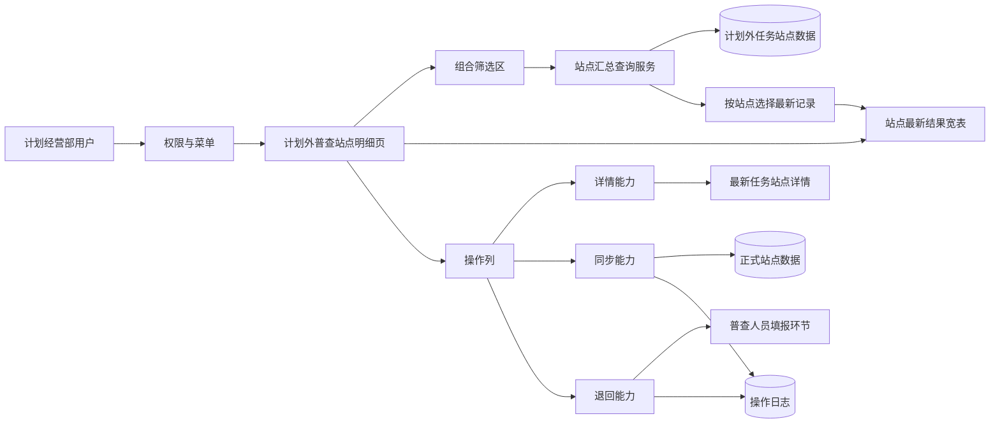
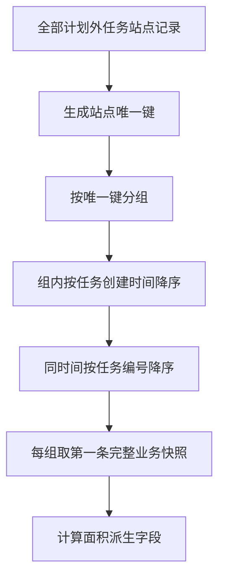
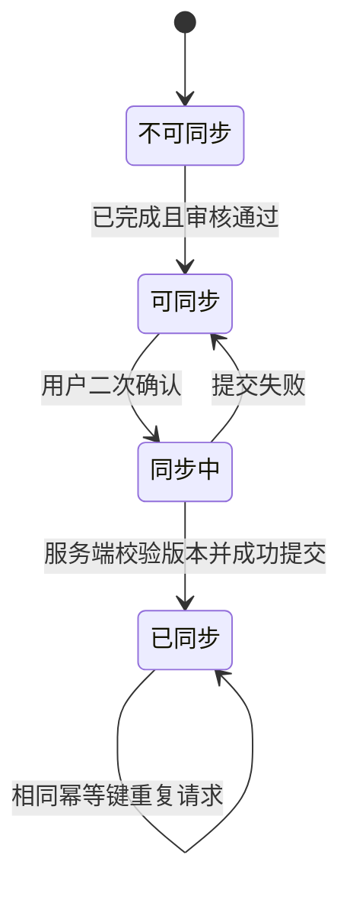

# 计划外普查站点明细 — 系统建设方案

> 版本：V1.0
> 日期：2026-07-22
> 状态：方案已通过，已实施，交互验收通过
> 关联规格：`docs/计划外普查站点明细-功能规格说明书.md`

## 一、建设目标

在现有独立 HTML 原型架构内新增计划经营部专用的“计划外普查站点明细”页面，复用现有计划外任务、站点、状态和详情能力，建立“全量任务站点汇聚 → 站点去重 → 最新记录选择 → 组合筛选 → 分页展示 → 详情/同步/退回”的完整产品路径。

正式系统方案以服务端聚合查询、角色权限、幂等同步和并发校验为边界；当前原型使用前端模拟数据表达相同规则。

## 二、产品架构



## 三、模块划分

| 模块 | 建设内容 | 原型影响位置 |
|------|----------|--------------|
| 菜单与权限 | 新增第四个二级菜单，仅计划经营部可见；增加页面访问边界说明 | 所有包含计划外侧栏的页面、新页面 |
| 数据聚合 | 汇总全部计划外任务站点，按站点唯一键选择最新任务快照 | 新页面模拟数据与数据处理函数 |
| 筛选模块 | 实现年度、站点、三类状态、类型、面积变化、年代和完成时间筛选 | 新页面筛选卡片 |
| 表格模块 | 展示 20 个业务字段和操作列，支持横向滚动 | 新页面宽表 |
| 状态模块 | 统一普查、下发、审核三类状态的口径与标签 | 新页面状态映射函数 |
| 面积计算 | 计算面积差、变化率和是否变化，统一精度与空值处理 | 新页面派生字段函数 |
| 详情路由 | 携带站点编码、最新任务 ID 和来源参数进入现有详情 | 新页面、详情页返回逻辑 |
| 同步操作 | 校验状态、二次确认、幂等提交、反馈结果 | 新页面确认弹窗与模拟状态 |
| 退回操作 | 校验状态、填写原因、退回填报并刷新状态 | 新页面退回弹窗与模拟状态 |
| 文档同步 | 更新页面清单、字段字典、交互规则和业务流程 | `docs/` 现有权威文档，方案通过后执行 |

## 四、核心数据模型

### 4.1 站点最新结果视图

```js
{
  siteKey: '60218B001',
  siteCode: '60218B001',
  siteName: '裕华区中心站',
  latestTaskId: 'OUT-2026-009',
  taskCreatedAt: '2026-07-20 09:30',
  surveyYear: 2026,
  surveyStatus: '已完成',
  dispatchStatus: '已下发',
  auditStatus: '审核通过',
  dept: '裕华管理部',
  zone: '裕华片区所',
  siteType: '自管站',
  office: '裕东街道',
  address: '示例用热地址',
  buildingYear: 2008,
  originalArea: 12000.000,
  currentArea: 12350.500,
  residentialDelta: 300.500,
  nonResidentialDelta: 50.000,
  surveyor: '李明',
  completedAt: '2026-07-21 16:20',
  resultVersion: 3,
  syncStatus: '未同步'
}
```

### 4.2 派生字段

```js
areaDelta = round3(currentArea) - round3(originalArea)
hasAreaChange = areaDelta !== 0
areaChangeRate = originalArea === 0 ? null : areaDelta / originalArea * 100
```

- 所有面积先统一为数值并四舍五入至 3 位小数。
- `null`、空字符串、非法数字均视为无有效结果，不参与变化判断。
- 变化率只用于展示，不反向参与是否变化判断。

### 4.3 去重选择



原型可使用稳定排序加 `Map` 实现；正式系统应在查询层使用窗口函数或等价方案完成，例如按 `site_key` 分区后以任务创建时间、任务编号降序生成行号并取第一行。

## 五、核心交互逻辑

### 5.1 数据处理顺序


必须先去重再筛选。否则旧任务可能因满足筛选条件而被展示，违背“每站点仅展示最新记录”的口径。

### 5.2 查询与重置

- 页面初始默认查询当前年度。
- 查询读取全部筛选控件，经校验后重置至第 1 页。
- 重置清空除当前年度外的全部条件，同时清除可能存在的排序状态。
- 条件通过 URL 查询参数保留，便于从详情页返回后恢复页面上下文。

### 5.3 详情

- 跳转参数建议：`?id={siteCode}&taskId={latestTaskId}&source=site-details`。
- 详情页优先以 `taskId + siteCode` 定位最新任务站点，避免仅以站点编码回退到错误任务。
- 详情返回时恢复站点明细页的年度、筛选条件和当前页。

### 5.4 同步

建议操作状态机：



- 前置条件：`surveyStatus=已完成`、`auditStatus=审核通过`、结果完整有效。
- 请求携带 `siteKey`、`latestTaskId`、`resultVersion` 和幂等键。
- 服务端事务内校验最新版本、写入正式站点数据、记录同步日志。
- 同一结果版本重复同步返回既有成功结果，不重复累计面积。
- 原型使用确认弹窗、加载态和成功提示模拟，不伪造真实后端持久化。

### 5.5 退回

- 前置条件：站点已经产生普查结果且 `syncStatus != 已同步`。
- 弹窗默认退回节点为“普查人员填报”，退回原因必填、最多 300 字。
- 成功后更新：`surveyStatus=进行中`、`auditStatus=已退回`、列表完成时间显示“—”并刷新最近操作记录。
- 历史完成时间和原审批记录不得删除，作为审计记录保留。
- 已同步结果禁止退回，避免正式站点数据与审批结果失配。

## 六、页面与布局方案

### 6.1 菜单顺序

```text
计划外面积普查
├─ 计划外普查任务管理
├─ 计划外普查任务
├─ 我的计划外普查任务
└─ 计划外普查站点明细
```

新页面高亮第四项；其余相关页面补充相同菜单入口。演示原型可基于顶栏固定身份表达权限，正式系统以权限码控制。

### 6.2 筛选区

- 桌面端采用高密度栅格布局，按截图分 3 行展示。
- 第一行：普查年度、换热站编码、换热站名称、普查状态。
- 第二行：站点类型、是否有面积变化、下发状态、审核状态。
- 第三行：建筑年代区间、普查完成时间区间、查询、重置。
- 屏幕宽度不足时允许筛选项换行，不产生横向页面滚动。

### 6.3 表格

- 业务列较多，表格设置明确的 `min-width` 并在卡片内部横向滚动。
- 序号、编码、名称及操作列保持视觉稳定；操作列固定右侧。
- 用热地址采用省略展示和 Tooltip；数值列右对齐；状态列使用文字标签。
- 表头不换行，单位写入列名。
- 分页默认 10 条/页，序号按 `(当前页-1)×每页条数+行号` 计算。

## 七、Ant Design 组件选型说明

当前原型继续使用原生 HTML/CSS/JavaScript，并在视觉和交互上对齐 Ant Design：

| 场景 | Ant Design 组件 | 原型实现 |
|------|-----------------|----------|
| 筛选表单 | `Form`、`Row`、`Col` | 现有栅格和 `.field` 结构 |
| 年度、状态、类型 | `Select` | 原生 `select.control` |
| 站点编码、名称 | `Input` | 原生 `input.control` |
| 年代区间 | `InputNumber` / 双输入 | `number` 输入框，限制四位年份 |
| 完成时间区间 | `DatePicker.RangePicker` | 两个 `date` 输入框 |
| 宽表 | `Table` | 表格容器横向滚动、操作列固定视觉位置 |
| 状态展示 | `Tag` | 紧凑状态标签，文字与颜色共同表达 |
| 地址完整文本 | `Tooltip` | `title` 或现有轻量提示样式 |
| 详情 | `Button type="link"` | 文本按钮 |
| 同步确认 | `Modal.confirm` | 现有确认弹窗样式 |
| 退回表单 | `Modal`、`Input.TextArea` | 模态框、文本域、校验提示与字数计数 |
| 操作反馈 | `message` | 成功、失败轻提示 |
| 空状态 | `Empty` | 表格内空状态 |
| 分页 | `Pagination` | 现有分页结构 |

### 7.1 状态标签建议

- 普查状态：未开始灰色、进行中蓝色、已完成绿色。
- 下发状态：未下发灰色、已下发蓝色。
- 审核状态：待填报灰色；所长/专工/主任审核橙色或主色；审核通过绿色；已退回红色。
- 所有状态必须展示文字，不能只依靠颜色区分。

## 八、接口与正式系统建议

### 8.1 汇总查询

`GET /api/out-plan-survey/site-details`

请求参数包含年度、站点编码、站点名称、普查状态、下发状态、审核状态、站点类型、面积变化、建筑年代区间、完成时间区间、页码和每页条数。

响应应直接返回去重后的分页结果及总数，前端不得自行拉取全量任务站点。

### 8.2 同步

`POST /api/out-plan-survey/site-details/{siteKey}/sync`

- 请求体：任务 ID、结果版本、幂等键。
- 返回：同步结果、正式站点数据版本、操作时间。
- 冲突返回明确错误码，提示刷新后重试。

### 8.3 退回

`POST /api/out-plan-survey/site-details/{siteKey}/return`

- 请求体：任务 ID、结果版本、退回节点、退回原因。
- 返回：最新普查状态、审核状态和操作时间。
- 服务端校验尚未同步且用户具备计划经营部退回权限。

## 九、性能、安全与审计

| 约束 | 方案 |
|------|------|
| 查询响应 | 普通条件下目标 2 秒内返回 |
| 操作响应 | 同步、退回目标 3 秒内返回明确结果 |
| 分页 | 服务端去重和筛选完成后分页 |
| 索引 | 站点键、任务创建时间、年度、状态、类型、完成时间建立组合或适用索引 |
| 越权 | 菜单、路由、接口三层校验计划经营部权限 |
| 重复同步 | 幂等键 + 结果版本 + 数据库事务 |
| 并发冲突 | 乐观锁；同步与退回只允许一个成功 |
| 审计 | 记录操作人、时间、任务、站点、前后版本和退回原因 |
| 敏感输出 | 地址等字段按正式权限范围返回，日志不打印完整业务数据 |

## 十、实施影响范围

方案通过后预计涉及：

- 新增 `plan-outside-survey-site-details.html`。
- 在所有包含计划外面积普查侧栏的页面增加第四个菜单入口。
- 按需调整 `pc-template-base.css` 的宽表、固定操作列或筛选布局公共能力；优先使用新页面局部样式，避免影响已有页面。
- 调整详情页，使其支持 `taskId + siteCode + source=site-details` 精确定位和返回。
- 同步更新 `docs/页面清单.md`、`docs/字段字典.md`、`docs/交互规则.md`、`docs/业务流程.md`。

## 十一、实施步骤

1. 建立站点明细模拟数据和站点去重选择函数。
2. 新建页面骨架、菜单、面包屑和筛选区。
3. 实现派生面积字段、组合筛选、分页和宽表渲染。
4. 接入详情路由并补充详情返回上下文。
5. 实现同步确认、状态校验、加载态和幂等演示。
6. 实现退回弹窗、原因校验和状态联动演示。
7. 将第四个菜单入口同步到相关页面。
8. 更新四份权威项目文档。
9. 执行静态检查、差异检查和浏览器交互验证。

## 十二、验证方案

### 12.1 静态验证

- 检查新增页面 HTML 结构和内联 JavaScript 语法。
- 扫描所有相关页面，确认第四个菜单入口和链接一致。
- 检查表头、行数据和空状态列数一致。
- 执行 `git diff --check`。

### 12.2 数据验证

- 构造同站点多任务数据，验证只保留最新任务完整快照。
- 验证临时站点无编码时仍可按临时 ID 去重。
- 验证面积精度、正负变化、无变化、原面积为 0 和空值。
- 验证三类状态彼此独立且显示正确。

### 12.3 交互验证

- 验证全部筛选项单独及组合查询、重置和无结果状态。
- 验证错误年代区间和日期区间会阻止查询。
- 验证详情精确进入最新任务站点并可恢复列表条件。
- 验证同步只对已完成且审核通过的结果可用，并防止重复提交。
- 验证退回原因必填、状态更新及已同步结果不可退回。
- 验证横向滚动、操作列可见、分页序号连续和长地址提示。
- 验证无权限角色不显示入口，直接访问时显示无权限状态。

## 十三、风险与控制

| 风险 | 控制措施 |
|------|----------|
| 先筛选后去重导致展示旧任务 | 强制执行“去重选最新 → 筛选 → 分页”顺序 |
| 最新状态与旧结果被拼接 | 每行只读取同一任务站点的完整业务快照 |
| 同步重复累计面积 | 使用结果版本、幂等键和事务 |
| 同步与退回并发冲突 | 服务端乐观锁和状态前置校验 |
| 宽表压缩不可读 | 内部横向滚动、明确列宽、右侧操作列固定 |
| 全量浏览器聚合性能差 | 正式系统服务端聚合、筛选和分页 |
| 只隐藏菜单造成越权 | 路由和接口同步进行权限校验 |

## 十四、授权门禁

方案已于2026-07-22获得通过，并已按本方案完成原型实施；静态检查与浏览器交互验收均已通过。

本次审批同时确认以下建议：

1. 最新任务按任务创建时间判定，同时间按任务编号兜底。
2. 同步指将“已完成且审核通过”的最新结果幂等写入正式站点数据。
3. 退回仅针对尚未同步的结果，统一退回普查人员填报，原因必填。
4. 已同步结果禁止直接退回；如需纠错，通过新任务重新普查。
5. 本期不实现导出和批量操作。
