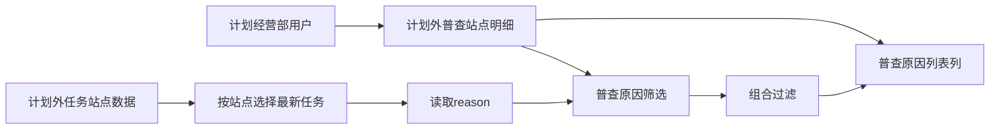
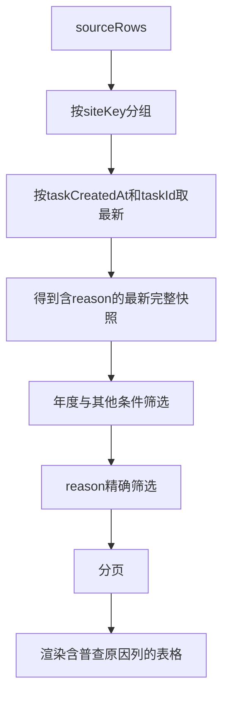

# 计划外普查站点明细增加“普查原因” — 系统建设方案

> 版本：V1.0
> 日期：2026-07-22
> 状态：方案已通过，已实施，交互验收通过
> 关联规格：`docs/计划外普查站点明细增加普查原因-功能规格说明书.md`

## 一、建设目标

在现有站点最新任务视图中补充 `reason` 字段，并将其接入筛选、URL状态、表格渲染和详情返回链路，保持“先按站点取最新任务，再筛选”的既有数据口径。

## 二、产品架构



## 三、模块划分

| 模块 | 建设内容 | 影响位置 |
|------|----------|----------|
| 数据模型 | 每条任务站点模拟数据增加 `reason` | `sourceRows` |
| 筛选控件 | 新增 `filterReason` 下拉 | 筛选区 |
| 筛选逻辑 | `readFilters()`和`filterRows()`接入原因精确匹配 | 页面脚本 |
| URL状态 | `syncUrl()`和`loadUrl()`持久化 `reason` | 页面脚本 |
| 表格 | 增加普查原因表头及单元格 | 表头、行渲染、空状态 |
| 重置 | 原因恢复为空值“全部” | 重置逻辑 |
| 文档 | 同步字段字典、交互规则和页面清单 | `docs/` |

## 四、数据模型

```js
{
  siteKey: '60218B001',
  latestTaskId: 'OUT-2026-011',
  reason: '面积变化'
}
```

### 4.1 字段约束

`reason`允许值：

```js
['面积变化', '一管到户', '新开户及增容', '趸售用户']
```

旧数据无值或未知值时，渲染为“—”；原因筛选只匹配合法且相等的字符串。

## 五、核心处理顺序



不得在去重前按原因筛选，否则历史任务可能错误替代最新任务进入结果。

## 六、核心交互逻辑

### 6.1 查询

```js
if (filters.reason && row.reason !== filters.reason) return false;
```

- 原因与其他筛选条件采用AND关系。
- 查询后回到第1页。
- URL增加 `reason={encodedValue}`。

### 6.2 重置

- `filterReason.value = ''`。
- URL移除 `reason`。
- 重新执行现有渲染流程。

### 6.3 详情返回

现有 `returnQuery`直接携带当前URL查询串，因此接入 `syncUrl()` 后，无需新增详情页参数解析；返回站点明细时自动恢复 `reason`。

## 七、页面布局

- 第一行顺序：普查年度、换热站编码、换热站名称、普查状态。
- “普查原因”紧随“普查状态”进入后续网格位置，其他字段依次顺延。
- 为保持四列布局，筛选区根据字段总数自然换行。
- 表格列顺序：换热站名称 → 普查状态 → 普查原因 → 下发状态。
- 表格最小宽度适度增加，操作列继续使用右侧粘性定位。

## 八、Ant Design组件选型说明

| 场景 | Ant Design组件 | 原型实现 |
|------|----------------|----------|
| 原因筛选 | `Select` | 原生 `select.control`，单选 |
| 原因列 | `Table.Column` | 普通文本单元格 |
| 查询重置 | `Button` | 沿用现有按钮 |
| 空状态 | `Empty` | `colspan`由21调整为22 |

## 九、实施步骤

1. 为全部模拟任务站点补充合法 `reason`。
2. 增加筛选下拉并调整筛选布局顺序。
3. 扩展筛选读取、URL恢复、组合过滤和重置逻辑。
4. 增加表头与行数据单元格，空状态列数改为22。
5. 调整表格最小宽度。
6. 同步字段字典、交互规则和页面清单。
7. 执行静态检查和浏览器交互验证。

## 十、验证方案

### 10.1 静态验证

- 解析页面内联JavaScript。
- 检查每条模拟数据均有合法 `reason`。
- 检查表头、行模板和空状态均为22列。
- 执行 `git diff --check`。

### 10.2 浏览器验证

- 验证下拉选项和默认值。
- 分别筛选四类原因并核对结果。
- 验证原因与普查状态组合筛选。
- 验证重置恢复“全部”。
- 验证同站点旧任务原因不影响最新结果。
- 验证详情返回后原因筛选仍保留。
- 验证横向滚动和操作列固定。
- 验证控制台无错误。

## 十一、风险与控制

| 风险 | 控制措施 |
|------|----------|
| 历史原因错误命中 | 强制先去重选最新，再筛选原因 |
| URL返回丢失原因 | 将 `reason`纳入统一筛选状态映射 |
| 表格列错位 | 同步修改表头、行模板和空状态 `colspan` |
| 宽表操作列不可见 | 增加最小宽度并保持粘性操作列 |
| 枚举不一致 | 直接复用现有四类原因，不新增别名 |

## 十二、授权门禁

方案已于2026-07-22获得通过，并已按本方案完成原型实施；静态检查与浏览器交互验收均已通过。
