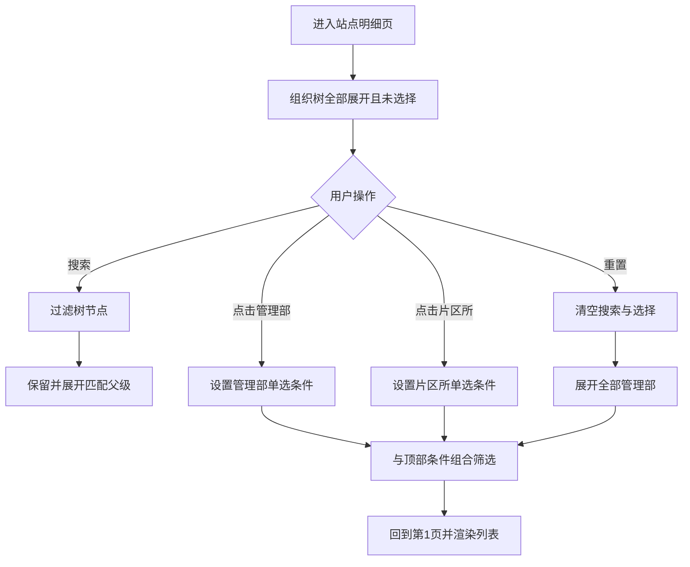

# 计划外普查站点明细增加组织机构树 — 功能规格说明书

> 版本：V1.0
> 日期：2026-07-22
> 状态：方案已通过，已实施
> 适用页面：`plan-outside-survey-site-details.html`

## 一、功能定义

在“计划外普查站点明细”页面的侧栏菜单与主内容之间增加独立的“组织机构”树形筛选栏。用户可搜索管理部或片区所，并通过点击组织节点筛选右侧站点明细。

## 二、本期范围

- 仅在“计划外普查站点明细”页面增加组织机构树。
- 组织树位于左侧菜单与右侧主内容之间。
- 展示管理部—片区所两级结构。
- 支持管理部展开/收起。
- 支持点击管理部或片区所筛选站点列表。
- 支持按管理部、片区所名称搜索树节点。
- 支持组织树独立重置。
- 组织筛选与页面顶部筛选条件采用AND关系。
- 默认不选择组织、展开所有管理部、展示全部站点。

## 三、不在本期范围

- 不在其他页面增加组织树。
- 不展示管理部或片区所的站点数量。
- 不实现组织数量随筛选条件动态变化。
- 不支持多选组织节点。
- 不修改现有站点归属数据和权限范围。

## 四、组织层级

```text
桥西管理部
├─ 桥西片区所
├─ 振头片区所
└─ 红旗片区所

长安管理部
├─ 长安片区所
└─ 谈固片区所

裕华管理部
├─ 裕华片区所
└─ 槐底片区所
```

组织节点本期不显示数量。无站点数据的片区所仍正常展示，点击后右侧显示空状态。

## 五、筛选规则

### 5.1 默认状态

- 所有管理部默认展开。
- 不选择任何组织节点。
- 右侧列表继续展示满足顶部筛选条件的全部站点。

### 5.2 点击管理部

- 点击管理部名称后，该管理部显示选中态。
- 右侧列表展示该管理部及其全部下属片区所的站点。
- 点击展开箭头只切换子节点显示，不改变筛选条件。

### 5.3 点击片区所

- 点击片区所后，仅该片区所显示选中态。
- 右侧列表仅展示该片区所站点。
- 单选切换：新选择替换原选择。

### 5.4 与顶部筛选组合

组织条件与普查年度、站点编码/名称、普查状态、普查原因、站点类型、面积变化、下发状态、审核状态、建筑年代和完成时间均采用AND关系。

数据处理顺序：

```text
全部任务站点 → 按站点去重选最新任务 → 顶部条件筛选 → 组织筛选 → 分页
```

### 5.5 搜索

- 搜索框提示：“搜索管理部或片区所”。
- 输入内容后按名称模糊匹配，忽略首尾空格。
- 命中片区所时保留并展开其父级管理部。
- 命中管理部时展示该管理部及其全部片区所。
- 搜索无结果时在树内展示“暂无匹配组织”。
- 搜索只过滤树节点，不自动改变右侧站点筛选；用户点击搜索结果后才应用组织条件。

### 5.6 重置

点击组织树标题右侧“重置”后：

- 清空搜索关键字。
- 清空组织选择。
- 展开全部管理部。
- 右侧列表恢复为仅受顶部筛选条件控制。
- 当前页回到第1页。

## 六、用户故事

### US-01 按管理部查看站点

```gherkin
场景: 选择桥西管理部
  当 用户点击“桥西管理部”
  那么 桥西管理部显示选中态
  并且 右侧仅展示管理部为桥西管理部的最新站点记录
```

### US-02 按片区所查看站点

```gherkin
场景: 选择裕华片区所
  当 用户点击“裕华片区所”
  那么 右侧仅展示片区所为裕华片区所的最新站点记录
```

### US-03 搜索组织

```gherkin
场景: 搜索片区所
  当 用户输入“槐底”
  那么 组织树展示裕华管理部和槐底片区所
  并且 裕华管理部自动展开
  但是 右侧列表在用户点击槐底片区所前不改变
```

### US-04 组合筛选

```gherkin
场景: 组织与普查原因组合
  假如 用户选择桥西管理部
  当 用户选择普查原因“面积变化”并点击查询
  那么 列表仅展示桥西管理部且最新任务原因为面积变化的站点
```

### US-05 重置组织

```gherkin
场景: 重置组织树
  假如 用户已选择片区所并输入搜索关键字
  当 用户点击组织树“重置”
  那么 搜索和选择均被清空
  并且 所有管理部展开
  并且 右侧恢复展示满足顶部条件的全部组织站点
```

## 七、业务流程



## 八、布局与视觉规则

- 页面从“菜单 + 主内容”调整为“菜单 + 组织树 + 主内容”三栏布局。
- 组织树栏建议宽度280px，保持白色卡片、圆角、边框和轻阴影。
- 标题行为“组织机构”，右侧为文字按钮“重置”。
- 搜索框位于标题下方。
- 管理部节点使用较高字重；片区所节点缩进展示。
- 选中节点使用主色文字和浅主色背景。
- 展开箭头与节点选择相互独立。
- 主内容保持 `minmax(0,1fr)`，表格继续内部横向滚动。
- 较窄桌面宽度下，顶部筛选区自动调整为两列，避免控件过度压缩。

## 九、异常与边界

- 组织树配置存在但当前数据无对应站点时，右侧显示现有空状态。
- 站点管理部或片区所为空时，仅在未选择组织时展示；选择组织后不命中。
- 收起已选管理部不清除筛选条件。
- 搜索隐藏已选节点时，组织筛选条件仍保留，选中状态在清空搜索后恢复可见。

## 十、验收标准

- [ ] 组织树位置、层级和名称与确认内容一致。
- [ ] 默认展开全部管理部且未选择组织。
- [ ] 展开箭头只控制显示，不触发筛选。
- [ ] 点击管理部和片区所分别正确筛选。
- [ ] 组织选择与顶部条件组合正确。
- [ ] 搜索管理部、片区所及无结果状态正确。
- [ ] 重置清空搜索、选择并展开全部管理部。
- [ ] 组织树不展示数量。
- [ ] 列表分页、详情、同步、退回不受影响。
- [ ] 页面无脚本和控制台错误。

## 十一、已确认事项

- 只在计划外普查站点明细页增加组织树。
- 位置为菜单与主内容之间。
- 点击管理部或片区所直接筛选；管理部包含全部下属片区所。
- 组织层级完全按本规格第四章执行。
- 本期不需要组织节点动态数量。
- 默认展示全部，支持搜索，重置后恢复全部并展开所有管理部。

## 十二、实施结果

- 已按本规格在站点明细页增加独立组织机构树。
- 已实现管理部/片区所单选、展开收起、组织搜索和独立重置。
- 已将组织条件接入现有筛选管线，并与顶部条件按AND关系组合。
- 组织节点未展示数量，默认全部展开且不选中任何组织。
