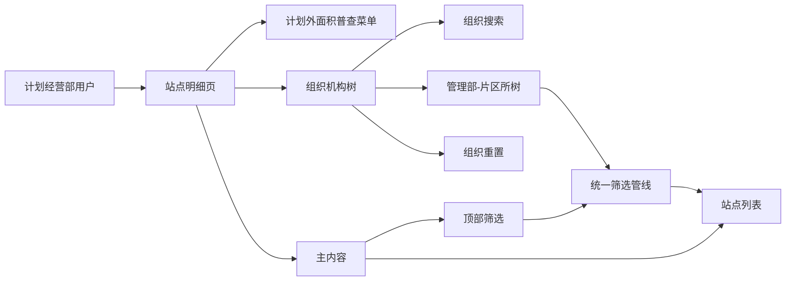
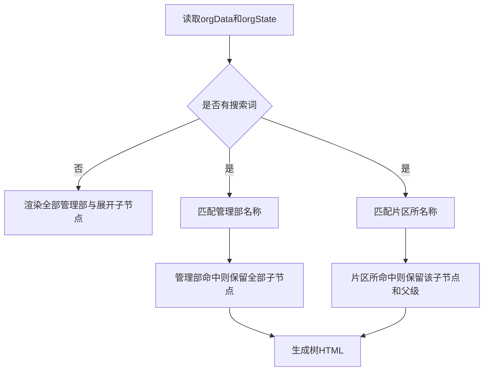

# 计划外普查站点明细增加组织机构树 — 系统建设方案

> 版本：V1.0
> 日期：2026-07-22
> 状态：方案已通过，已实施
> 关联规格：`docs/计划外普查站点明细增加组织机构树-功能规格说明书.md`

## 一、建设目标

在现有站点明细页中增加独立组织树筛选模块，将页面扩展为三栏桌面布局，并在不改变最新任务去重、顶部筛选、分页和操作逻辑的前提下增加单组织过滤能力。

## 二、产品架构



## 三、模块划分

| 模块 | 建设内容 | 影响位置 |
|------|----------|----------|
| 三栏布局 | 在侧栏和主内容间增加组织栏 | 页面主体结构、局部CSS |
| 组织配置 | 配置3个管理部、7个片区所 | 页面脚本常量 |
| 树渲染 | 管理部展开/收起、片区所缩进、选中态 | 组织栏HTML/JS |
| 组织搜索 | 模糊过滤管理部和片区所 | 搜索输入事件 |
| 组织选择 | 单选管理部或片区所 | 页面状态、节点事件 |
| 筛选接入 | 组织条件接入最新站点筛选管线 | `filterRows()` |
| 组织重置 | 清空搜索/选择、全部展开、回第1页 | 重置事件 |
| 文档同步 | 更新页面清单、交互规则、字段说明 | `docs/` |

## 四、页面结构

```html
<div class="body site-detail-layout">
  <aside class="sidebar">...</aside>
  <aside class="org-panel">
    <header>组织机构 / 重置</header>
    <input id="orgSearch">
    <div id="orgTree"></div>
  </aside>
  <main class="main">...</main>
</div>
```

### 4.1 三栏栅格

```css
.site-detail-layout {
  grid-template-columns: var(--sidebar-width) 280px minmax(0, 1fr);
}
```

- 左侧菜单宽度沿用全局变量。
- 组织栏宽度280px。
- 主内容允许收缩，宽表仍在 `.table-scroll` 内滚动。
- 组织栏高度至少覆盖可视区域，内部卡片保持适当外边距。

## 五、组织数据模型

```js
var orgData = [
  { dept: '桥西管理部', zones: ['桥西片区所', '振头片区所', '红旗片区所'] },
  { dept: '长安管理部', zones: ['长安片区所', '谈固片区所'] },
  { dept: '裕华管理部', zones: ['裕华片区所', '槐底片区所'] }
];
```

本期为静态原型配置，不展示数量。正式系统建议由组织接口返回树结构，并使用稳定组织ID而非名称作为筛选键。

## 六、页面状态模型

```js
var orgState = {
  keyword: '',
  selectedType: '', // '' | 'dept' | 'zone'
  selectedValue: '',
  expandedDepts: new Set(['桥西管理部', '长安管理部', '裕华管理部'])
};
```

- 节点选择为单选。
- 展开集合与选择状态独立。
- 搜索临时决定可见节点，不改写选择状态。

## 七、核心交互逻辑

### 7.1 树渲染



### 7.2 节点点击

- 展开按钮：仅切换 `expandedDepts` 并重绘树。
- 管理部名称：设置 `selectedType='dept'`、`selectedValue=dept`。
- 片区所名称：设置 `selectedType='zone'`、`selectedValue=zone`。
- 选择成功后设置 `currentPage=1` 并执行 `render()`。

### 7.3 组织过滤

在现有最新站点和顶部条件过滤之后增加：

```js
if (orgState.selectedType === 'dept' && row.dept !== orgState.selectedValue) return false;
if (orgState.selectedType === 'zone' && row.zone !== orgState.selectedValue) return false;
```

### 7.4 搜索

- `input`事件更新 `keyword`并重绘树。
- 去除首尾空格后进行包含匹配。
- 搜索不调用列表 `render()`，不改变已选组织。

### 7.5 重置

- `keyword=''`并同步清空输入框。
- 清空 `selectedType`和`selectedValue`。
- `expandedDepts`恢复三个管理部。
- `currentPage=1`，重绘树和列表。

## 八、URL与返回策略

本期组织筛选是页面内状态，不写入URL。进入详情后通过浏览器返回仍可依赖历史页面状态；若页面重新加载，组织条件恢复为全部。

> 原因：用户未要求详情返回恢复组织条件，且当前组织树为静态原型能力。正式系统建议后续使用 `orgType`、`orgValue`查询参数统一持久化。

## 九、Ant Design组件选型说明

| 场景 | Ant Design组件 | 原型实现 |
|------|----------------|----------|
| 组织卡片 | `Card` | `.org-card` |
| 搜索 | `Input.Search` | 原生输入框与搜索图标 |
| 组织树 | `Tree` | 自定义两级树节点 |
| 选中态 | `Tree selectedKeys` | `.org-node.selected` |
| 展开态 | `Tree expandedKeys` | `expandedDepts`集合 |
| 重置 | `Button type="link"` | 文字按钮 |
| 空结果 | `Empty` | 树内轻量空状态 |

## 十、实施步骤

1. 调整站点明细页主体为三栏布局。
2. 增加组织栏结构和样式。
3. 配置管理部、片区所静态树数据。
4. 实现树渲染、展开/收起和选中态。
5. 实现组织搜索和无结果状态。
6. 将组织单选条件接入 `filterRows()`。
7. 实现组织重置及分页复位。
8. 增加窄屏桌面布局适配。
9. 同步页面清单、交互规则和字段说明。
10. 执行静态检查和浏览器交互验证。

## 十一、验证方案

### 11.1 静态验证

- 解析页面内联JavaScript。
- 检查组织配置包含3个管理部、7个片区所。
- 检查组织筛选在去重后执行。
- 执行 `git diff --check`。

### 11.2 浏览器验证

- 验证三栏位置、组织卡片样式和主内容滚动。
- 验证默认全部展开、无选中组织。
- 验证管理部展开/收起不改变列表。
- 验证3个管理部筛选。
- 验证有数据和无数据片区所筛选。
- 验证组织与普查原因等顶部条件组合。
- 验证搜索管理部、搜索片区所和无结果状态。
- 验证搜索不自动改变列表。
- 验证重置清空搜索/选择、展开全部并回到第1页。
- 验证分页、详情、同步、退回无回归。
- 验证控制台无错误。

## 十二、风险与控制

| 风险 | 控制措施 |
|------|----------|
| 点击箭头误触筛选 | 展开按钮与节点按钮使用独立 `data-action` |
| 搜索导致选择丢失 | 搜索只控制可见节点，不清除选择状态 |
| 组织条件与顶部条件冲突 | 统一在 `filterRows()`中使用AND关系 |
| 主内容被组织栏挤压 | 主栏使用 `minmax(0,1fr)`，宽表内部滚动，窄屏筛选改两列 |
| 静态组织与正式数据不一致 | 原型明确静态；正式系统使用组织ID和接口数据 |
| 空组织误认为加载失败 | 使用明确空状态文案“暂无匹配站点” |

## 十三、授权门禁

方案已于2026-07-22通过，已按本建设方案完成页面实施。
