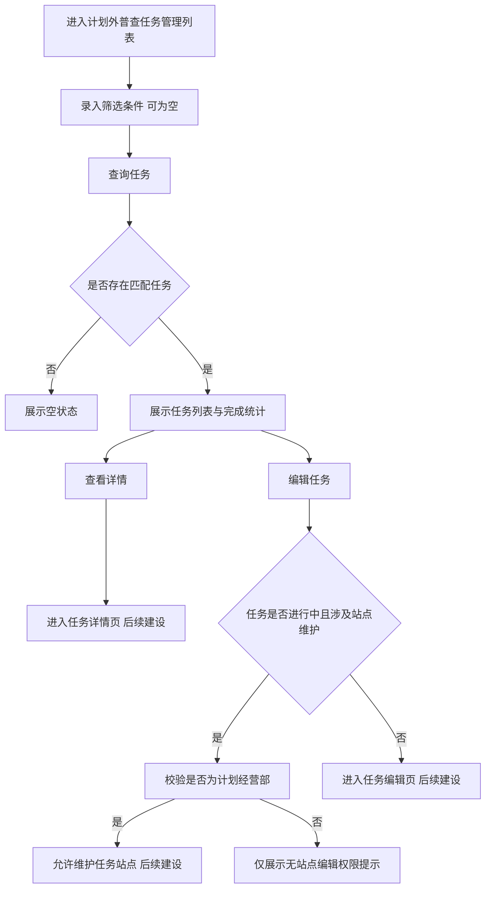

# 计划外面积普查任务管理列表｜功能规格说明书

## 1. 文档信息

| 项目 | 内容 |
|---|---|
| 模块 | 计划外面积普查 |
| 页面 | 计划外普查任务管理列表 |
| 当前范围 | 列表查询、任务详情跳转、编辑入口与原型模拟交互 |
| 不在本期范围 | 创建任务、任务站点维护页面的具体实现 |

## 2. 功能定义

计划外面积普查用于承接年度面积普查计划之外，因临时业务变化、供热关系调整或新增供热对象产生的面积普查需求。本页面集中展示计划外普查任务，帮助计划经营部与管理部快速查询任务进度、识别面积变化影响，并进入任务详情或编辑任务基础信息。

## 3. 已确认与待确认

### 已确认

- 管理部、计划经营部均可创建计划外普查任务；创建功能不属于本次页面原型范围。
- 任务状态仅包含：草稿、进行中、已完成。
- 任务完成统计按“已完成站点数 / 总站点数”展示。
- 列表支持按任务名称、普查原因、任务状态、站点名称/编码、所属管理部筛选。
- “所属管理部”为任务归属管理部，而非站点归属管理部。
- 列表操作包含“详情”“编辑”。
- 计划经营部可编辑进行中任务下的站点；该规则需在后续任务详情/站点页面承接，列表页仅保留进入编辑的入口。
- 本页面需提供可点击跳转与模拟交互。

### 待确认

- 草稿、进行中、已完成三种状态分别允许编辑哪些任务基础字段；本期原型暂以“编辑”入口可用展示，不模拟保存校验。
- “有面积变化站点数”的统计口径（例如以站点最终确认面积与原登记面积不同为准）将在后续站点普查规则中确认。
- 任务详情页面与编辑页面的字段、流程和站点操作边界，在后续逐页确认。

## 4. 用户故事

1. 作为计划经营部人员，我希望筛选计划外普查任务，以便掌握不同原因和状态的任务推进情况。
2. 作为管理部人员，我希望按本站点名称或编码定位任务，以便快速进入任务详情查看普查进度。
3. 作为任务管理人员，我希望看到完成站点数、总站点数和面积变化站点数，以便判断任务的剩余工作量与影响范围。
4. 作为计划经营部人员，我希望从进行中任务进入编辑页维护站点，以便处理临时面积普查的实际变化。

## 5. 页面功能与字段

### 5.1 筛选区

| 筛选项 | 控件 | 规则 |
|---|---|---|
| 任务名称 | 文本输入框 | 支持模糊匹配 |
| 普查原因 | 下拉选择 | 默认“全部”；选项至少覆盖临时业务变化、供热关系调整、新增供热对象 |
| 任务状态 | 下拉选择 | 默认“全部”；草稿、进行中、已完成 |
| 站点名称/编码 | 文本输入框 | 任一任务下站点名称或编码匹配时返回该任务 |
| 所属管理部 | 下拉选择 | 按任务归属管理部筛选 |
| 查询 | 主按钮 | 组合应用全部非空筛选条件 |
| 重置 | 默认按钮 | 清空条件并恢复全部任务列表 |

### 5.2 列表字段

| 列 | 展示/规则 |
|---|---|
| 序号 | 按当前分页结果连续编号 |
| 任务名称 | 任务主标识；点击进入任务详情页 |
| 普查原因 | 展示任务创建时登记的原因 |
| 站点数 | 任务纳入的总站点数 |
| 所属管理部 | 任务归属的管理部 |
| 开始时间 | 任务计划或实际开始日期，格式 `YYYY-MM-DD` |
| 结束时间 | 任务计划结束日期，格式 `YYYY-MM-DD` |
| 任务完成统计 | `已完成站点数 / 总站点数`；原型可附进度条与百分比作为辅助表达 |
| 有面积变化站点数 | 任务内存在面积变化的站点总数；无变化时显示 `0` |
| 任务状态 | 草稿、进行中、已完成，使用差异化状态标签 |
| 创建人 | 任务创建人姓名 |
| 操作 | 详情、编辑 |

### 5.3 交互规则

| 场景 | 原型行为 |
|---|---|
| 点击查询 | 根据预置模拟数据刷新表格、总数与分页；无结果显示空状态 |
| 点击重置 | 恢复默认筛选条件和完整模拟列表 |
| 点击任务名称或“详情” | 跳转至后续的任务详情原型占位页 |
| 点击“编辑” | 跳转至后续的任务编辑原型占位页；进行中任务的站点编辑权限提示“仅计划经营部可维护” |
| 点击分页 | 切换预置数据页码 |

## 6. 业务流程

## 7. 验收标准

- 完整展示 12 个指定列，表头与数据列不因缺省数据被移除。
- 五项筛选条件均可单独及组合模拟，站点名称/编码按任务下站点匹配。
- 完成统计统一展示为“已完成站点数 / 总站点数”。
- 三种状态呈现清晰且可区分的标签样式。
- 任务名称、“详情”“编辑”均可点击并有明确的原型反馈或页面跳转。
- 在常见 PC 宽度下保持表格横向可滚动，避免信息列挤压换行。
