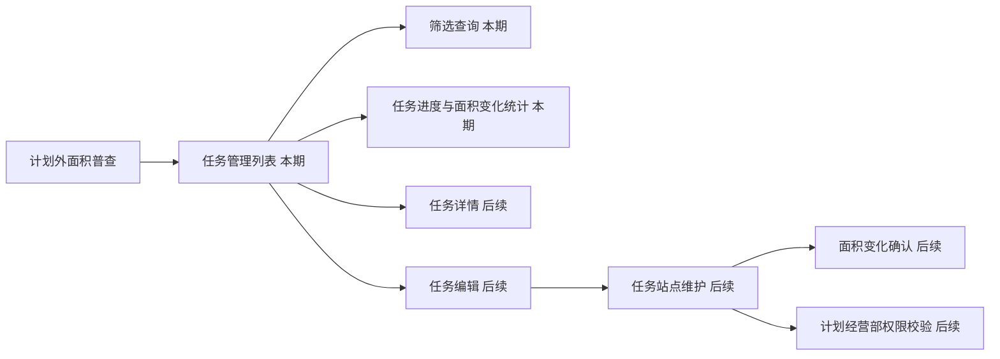

# 计划外面积普查任务管理列表｜系统建设方案

## 1. 建设目标

基于工作区的 `style-guide.md` 与 `pc-template-base.css`，建设独立 HTML 原型页面，采用高密度 Ant Design 风格中后台布局。首期只实现计划外普查任务的查询与列表浏览，并为后续详情、编辑和站点维护页面预留稳定跳转边界。

## 2. 产品架构

## 3. 页面与模块划分

| 模块 | 内容 | 本期交付 |
|---|---|---|
| 应用骨架 | 56px 顶栏、220px 侧栏、面包屑、主内容区 | 是 |
| 筛选条件卡片 | 任务名称、普查原因、任务状态、站点名称/编码、所属管理部、查询/重置 | 是 |
| 任务列表卡片 | 任务字段表格、状态标签、进度表达、横向滚动 | 是 |
| 模拟数据层 | 预置多状态任务、站点关联数据、组合筛选、空态和分页 | 是 |
| 详情页占位 | 从任务名称/详情进入的说明页 | 是，作为跳转目标 |
| 编辑页占位 | 从编辑进入的说明页及进行中站点权限提示 | 是，作为跳转目标 |
| 创建任务 | 新建任务及任务选站 | 否 |
| 真实权限与数据接口 | 用户身份、数据持久化、服务端过滤 | 否，仅原型模拟 |

## 4. 核心交互逻辑

### 4.1 筛选与统计

1. 页面初始化时加载预置任务和站点映射。
2. 输入或选择条件后点击“查询”，以任务为查询单位进行组合过滤。
3. 对“站点名称/编码”执行任务内站点的包含匹配；命中任意站点即保留该任务。
4. 分页基于过滤后的任务集合计算；列表序号随页码连续递增。
5. 重置清空所有条件，恢复完整任务数据和第一页。

### 4.2 跳转与权限模拟

1. 任务名称与“详情”操作均指向同一任务详情占位页，并携带任务标识。
2. “编辑”指向任务编辑占位页，并携带任务状态。
3. 当任务为进行中时，编辑占位页明确说明：仅计划经营部可以维护任务下站点；管理部可创建任务但不具备该站点编辑权限。
4. 本期不实现创建、保存、删除、状态流转或真实登录鉴权。

## 5. 组件与样式选型

| 区域 | 原型组件/样式 | 选型理由 |
|---|---|---|
| 页面框架 | `.topbar`、`.sidebar`、`.main` | 直接符合参考规范的 PC 中后台结构 |
| 筛选区 | `.card`、`.filter-grid`、`.field`、`.control`、`.btn` | 信息密度适中，适配五项条件及查询操作 |
| 列表 | `.card`、`.table-scroll`、`table` | 12 列任务数据需要固定表头语义与横向滚动 |
| 任务状态 | `.status-tag` 的草稿/进行中/已完成变体 | 快速建立状态识别，保持视觉一致 |
| 完成统计 | 文本 `已完成/总数` + 轻量进度条 | 主口径明确，进度作为辅助扫读信息 |
| 操作入口 | `.action-row`、`.action-link` | 避免表格内按钮拥挤，突出详情与编辑 |
| 无结果 | 空状态面板 | 让组合筛选的无匹配结果有明确反馈 |
| 分页 | `.pagination`、`.page-number` | 模拟多页任务数据与序号规则 |

## 6. 原型文件规划

| 文件 | 用途 |
|---|---|
| `plan-outside-survey-task-list.html` | 计划外普查任务管理列表主页面 |
| `plan-outside-survey-task-detail.html` | 任务详情跳转占位页，后续扩展为正式详情页 |
| `plan-outside-survey-task-edit.html` | 任务编辑跳转占位页，后续扩展为正式编辑页 |
| `pc-template-base.css` | 复用现有样式基座 |

## 7. 质量与验证方案

- 静态检查：HTML 结构、CSS/JS 语法与相对链接有效性。
- 交互验证：五项筛选、组合筛选、重置、无结果、分页、详情与编辑跳转。
- 视觉验证：在桌面端浏览器检查顶栏、侧栏、筛选卡片、12 列表格横向滚动和状态标签；表格最小宽度遵循参考规范的 `1440px` 建议。
- 可访问性基础：输入框具备可见标签，按钮文案明确，状态不只依赖颜色表达。

## 8. 实施边界

本方案获批后仅制作上述列表页、详情/编辑跳转占位与模拟交互。任务创建、站点维护、正式权限控制和接口联调必须在后续需求确认及方案批准后再实施。
