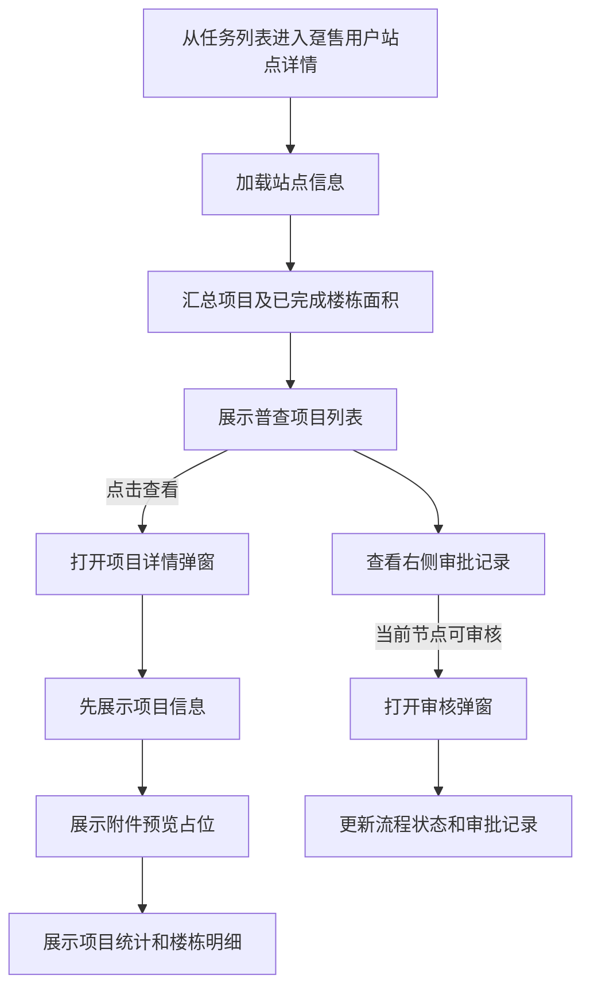

# 趸售用户站点详情 — 功能规格说明书

> 版本：V1.1
> 日期：2026-07-22
> 状态：V1.1 已实施，交互验收由用户执行
> 参考页面：`plan-outside-survey-task-dh-fill.html`、`plan-outside-survey-task-dh-project-fill.html`

## 一、功能定义

新增“趸售用户站点详情”只读页面，用于查看趸售用户任务的站点信息、面积统计、普查项目及审批过程。页面复用现有趸售用户填报数据和展示口径，不提供站点、项目或楼栋数据编辑能力；审核属于流程操作，不视为业务数据编辑。

## 二、用户故事

- 作为审核人员，我希望在一个页面查看趸售站点的基础信息、面积汇总和全部普查项目，以便判断填报是否完整。
- 作为审核人员，我希望从项目列表进入只读项目详情，先核对项目信息，再查看项目下的楼栋数据和附件预览。
- 作为任务查看人员，我希望查看完整审批记录，以便追溯任务处理过程。

## 三、页面结构

页面主体采用“左侧业务详情 + 右侧审批记录”布局。

### 3.1 左侧业务详情

按以下顺序展示：

1. 站点信息
2. 面积统计
3. 普查项目列表

### 3.2 站点信息

| 字段 | 展示规则 |
|------|----------|
| 站点名称 | 展示当前趸售站点名称 |
| 换热站编码 | 展示站点编码 |
| 用热地址 | 展示完整地址 |
| 所属管理部 | 只读展示 |
| 所属片区所 | 只读展示 |
| 行政区 | 只读展示 |
| 办事处 | 只读展示 |
| 普查人员 | 只读展示 |
| 联系人 | 无值时展示 `-` |
| 联系方式 | 无值时展示 `-` |

不展示“编辑”入口。

### 3.3 面积统计

保留填报页的两张统计卡：

- 任务总面积（参考）
- 本次填报面积

每张统计卡展示住宅面积、高层、多层、公寓、非住宅、非居、非协。站点统计由当前配置的普查项目及其已完成楼栋自动汇总；待普查或面积为 `/` 的楼栋不计入本次填报面积。

### 3.4 普查项目列表

前期使用现有趸售用户填报页配置的 3 条项目数据。

| 字段 | 说明 |
|------|------|
| 序号 | 当前页顺序 |
| 项目名称 | 项目主标识 |
| 用热地址 | 项目地址 |
| 建筑物数量 | 项目下楼栋数量 |
| 原面积 | 项目原普查面积汇总 |
| 现普查面积 | 已完成楼栋现面积汇总 |
| 面积变化 | 现面积减原面积 |
| 平面图 | 已上传/未上传状态 |
| 操作 | 仅保留“查看” |

不展示复选框、导入数据、新增普查项目、编辑、删除、录入变更、暂存或上报按钮。

### 3.5 项目详情

点击项目列表“查看”后打开只读项目详情弹窗，内容顺序固定为：

1. 项目信息
2. 附件预览占位
3. 项目面积统计
4. 项目下楼栋明细

项目信息展示项目名称、项目编码、用热地址、所属管理部、所属片区所、行政区、办事处、普查人员、联系人、联系方式、未入网建筑物数量和项目小结。

楼栋明细沿用项目填报页字段：楼号或建筑物名称、层数、用热性质、收费类别、普查状态、原面积、现面积、面积变化、变化率、控制方式、暖气类型、建筑物年代、普查依据、附件和备注。项目详情内不提供新增、编辑、删除或录入变更操作。

### 3.6 附件预览

- 普查明细表：展示 PDF 文件信息和 A4 比例静态预览占位图。
- 平面图：展示静态图片/图纸预览占位。
- 楼栋普查依据附件：展示文件名称；点击后打开对应类型的静态预览占位。
- 本期不加载真实文件，不实现翻页、缩放、下载或打印。

### 3.7 审批记录与审核

- 页面右侧展示审批记录时间线，包含节点、处理人、时间和审批意见。
- 保留当前审核节点对应的“审核”按钮。
- 审核按钮仅改变流程状态和审批记录，不允许修改站点、项目或楼栋业务数据。
- 返回按钮返回来源任务列表。

### 3.8 计划外普查任务列表入口（V1.1 增量）

- 在 `plan-outside-survey-task-items.html` 中，趸售用户任务名称展示为普通文本，不允许点击跳转。
- 趸售用户仅通过操作列“详情”进入 `plan-outside-survey-task-dh-detail.html`。
- 当前趸售任务 `60218B007` 进入后展示“裕华区东南站”对应站点信息，不复用 `60218B013` 的站点名称和编码。
- 详情链接携带 `source=items`，面包屑和返回按钮回到“计划外普查任务”。
- 从“我的计划外普查任务”进入时携带 `source=worker`，返回个人任务列表。
- 非趸售用户任务保持当前普通详情页路由不变。

### 3.9 主任审核上下文（V1.1 增量）

从 `60218B007` 进入时：

- 页面状态显示“主任审核”。
- 演示身份显示“管理部主任”。
- 审核不通过时可退回到“管理部专工审核”“片区所审核”或“普查人员填报”。
- 审核通过后状态更新为“审核通过”。
- 审核不通过后状态更新为“已退回”，审批记录写明选定退回节点和审批意见。
- 审批意见不通过时必填，最多 300 字；通过时选填。

## 四、业务流程



## 五、异常与边界

- URL 参数缺失或无法匹配趸售站点时，展示明确的“未找到站点”空状态，不回退为普通自管站详情。
- 项目为空时显示“暂无普查项目”，面积统计为 0。
- 项目存在但楼栋为空时，项目详情保留项目信息和附件区域，楼栋区展示空状态。
- 缺失字段统一展示 `-`；缺失附件展示“未上传”，不得生成可点击的伪文件链接。
- 未完成楼栋的现面积、变化和变化率展示 `—`，且不参与本次填报面积计算。
- 普查项目较多时使用横向滚动和分页，操作列固定在右侧；首期沿用每页 10 条。
- 审批记录较长时在卡片内部自然纵向延伸，不得挤出页面视口。

## 六、验收标准

```gherkin
场景: 查看趸售用户站点详情
  假如 当前任务的普查原因为“趸售用户”
  当 用户进入站点详情
  那么 页面依次展示站点信息、面积统计和普查项目列表
  并且 不展示任何业务数据编辑入口

场景: 自动计算面积统计
  假如 项目下同时存在已完成和待普查楼栋
  当 页面计算本次填报面积
  那么 只汇总已完成楼栋的现普查面积

场景: 查看项目详情
  当 用户点击项目操作列“查看”
  那么 打开只读项目详情弹窗
  并且 先展示项目信息
  并且 展示附件预览占位、项目统计和楼栋明细

场景: 查看附件
  当 用户点击普查明细表、平面图或楼栋附件
  那么 展示对应的静态预览占位
  并且 不提供真实下载、翻页、缩放或打印

场景: 执行审核
  假如 当前用户具备当前节点审核权限
  当 用户提交审核结果
  那么 仅更新流程状态和审批记录
  并且 站点、项目和楼栋业务数据保持不变

场景: 从计划外普查任务查看趸售详情
  假如 当前行为普查原因“趸售用户”且站点编码为“60218B007”
  当 用户查看任务列表
  那么 任务名称不可点击
  当 用户点击操作列“详情”
  那么 打开裕华区东南站的趸售用户站点详情
  并且 页面状态显示“主任审核”

场景: 按来源返回
  假如 用户从“计划外普查任务”进入趸售详情
  当 用户点击返回
  那么 返回“计划外普查任务”列表
  假如 用户从“我的计划外普查任务”进入趸售详情
  当 用户点击返回
  那么 返回“我的计划外普查任务”列表
```

## 七、确认状态

### 已确认

- 页面业务数据纯只读。
- 页面按站点信息、面积统计、普查项目列表展示。
- 项目“查看”进入项目下楼栋详情，且先展示项目信息。
- 首期复用当前 3 条项目数据并自动计算面积。
- 附件展示静态预览占位。
- 展示审批记录并保留审核按钮。
- 计划外普查任务中的趸售任务名称不可跳转，仅操作列“详情”可进入。
- `60218B007` 展示裕华区东南站数据并按主任审核规则处理。
- 详情页根据 `source` 参数返回对应任务列表。

### 待确认

- 无。
