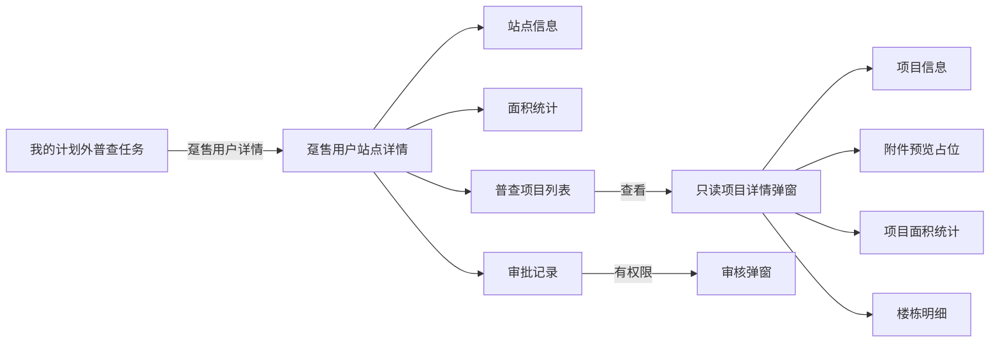

# 趸售用户站点详情 — 系统建设方案

> 版本：V1.1
> 日期：2026-07-22
> 状态：V1.1 已实施，交互验收由用户执行
> 关联规格：`docs/趸售用户站点详情-功能规格说明书.md`

## 一、建设目标

基于现有趸售用户站点填报页和项目填报页，新建一套只读站点详情展示能力。复用现有模拟数据、面积口径和视觉基座，将填报操作替换为查看交互，并补充项目详情、附件预览占位及审批记录。

## 二、产品架构



## 三、页面与文件规划

| 文件/模块 | 作用 |
|-----------|------|
| `plan-outside-survey-task-dh-detail.html` | 新增趸售用户站点详情页面 |
| `plan-outside-survey-task-dh-fill.html` | 数据和字段结构参考，不改动填报能力 |
| `plan-outside-survey-task-dh-project-fill.html` | 项目信息、统计和楼栋字段参考 |
| `plan-outside-survey-task-worker.html` | 趸售用户任务“查看/详情”入口按需要接入新页面 |
| `docs/` | 同步页面清单、交互规则、字段字典和业务流程 |

## 四、模块划分

| 模块 | 核心职责 |
|------|----------|
| 详情上下文 | 解析任务/站点参数，校验普查原因为趸售用户 |
| 站点信息 | 只读渲染站点字段 |
| 站点统计 | 汇总当前项目及已完成楼栋面积 |
| 项目列表 | 展示 3 条模拟项目、平面图状态和查看入口 |
| 项目详情 | 弹窗内按项目信息、附件、统计、楼栋顺序展示 |
| 附件预览 | 按附件类型生成 PDF 或图片静态占位 |
| 审批记录 | 展示审批时间线并承载审核入口 |
| 空状态 | 处理无站点、无项目、无楼栋和未上传附件 |
| 来源路由 | 按 `source=items/worker` 控制面包屑和返回地址 |
| 审核上下文 | 按站点任务配置切换审核状态、身份和退回节点 |

## 五、核心数据设计

### 5.1 站点对象

复用现有 `siteMock` 字段，并增加任务编号、审核状态等详情上下文字段。所有字段只读。

### 5.2 项目对象

```text
id, name, code, addr, dept, zone, district, office,
worker, contact, phone, unNet, summary, planFile,
surveyFile, buildings
```

首期将现有 3 条 `projects` 模拟数据补齐项目详情字段，并与各自楼栋数组建立明确关联，不通过项目名称模糊匹配。

### 5.3 面积计算

- 项目原面积：项目下楼栋原普查面积合计。
- 项目现面积：仅合计 `status === '完成'` 的现普查面积。
- 项目面积变化：项目现面积减项目原面积。
- 站点面积：对项目结果再次汇总，并按收费类别计算住宅与非住宅分类。
- `/`、`—`、空值或非法数值按 0 参与聚合，但在明细中保持未完成展示符号。

## 六、核心交互逻辑

### 6.1 页面加载

1. 解析 URL 中的任务或站点标识。
2. 查找对应趸售用户站点上下文。
3. 渲染站点信息、统计、项目列表和审批记录。
4. 无匹配数据时进入专用空状态。

### 6.2 项目查看

1. 点击操作列“查看”。
2. 按项目 ID 读取项目详情。
3. 重置弹窗滚动位置和上一次附件预览状态。
4. 先渲染项目信息，再渲染附件、项目统计和楼栋表格。
5. 关闭弹窗不改变任何项目数据。

### 6.3 附件预览

- PDF：文件卡片 + A4 页面比例预览占位。
- 平面图：文件卡片 + 图纸缩略占位。
- 其他附件：文件卡片 + 通用文件预览占位。
- 未上传：禁用点击并展示未上传状态。

### 6.4 审核

- 复用现有详情页审核弹窗与审批时间线模式。
- 审核提交只更新前端模拟状态和新增审批记录。
- 所有业务信息展示控件保持只读，不因审核结果切换为编辑态。

### 6.5 计划外普查任务路由分流（V1.1）

- 在 `plan-outside-survey-task-items.html` 渲染每行时先判断 `reason === '趸售用户'`。
- 三个计划外普查任务列表的任务名称均使用不可点击文本，业务跳转统一由操作列承载。
- 趸售用户“详情”地址为 `plan-outside-survey-task-dh-detail.html?id={siteCode}&source=items`。
- 非趸售用户“详情”继续指向 `plan-outside-survey-task-detail.html?id={siteCode}`。
- `plan-outside-survey-task-worker.html` 的趸售详情链接补充 `source=worker`。

### 6.6 多站点详情上下文（V1.1）

新增以站点编码为键的详情上下文：

| 站点编码 | 站点名称 | 来源 | 当前审核状态 | 演示身份 |
|----------|----------|------|--------------|----------|
| `60218B007` | 裕华区东南站 | `items` | 主任审核 | 管理部主任 |
| `60218B013` | 趸售用户一号站 | `worker` | 片区所审核 | 片区所 |

- 页面初始化时同时解析 `id` 和 `source`。
- `id` 决定站点信息、标题、状态及审核上下文。
- `source` 只决定面包屑和返回地址，不用于推断站点数据。
- 未识别 `id` 继续展示专用空状态；未识别 `source` 默认返回“计划外普查任务”。

### 6.7 主任审核配置（V1.1）

- 通过：隐藏退回节点，审批意见选填；提交后状态为“审核通过”。
- 不通过：显示退回节点，选项为管理部专工审核、片区所审核、普查人员填报；审批意见必填。
- 审核记录标题使用“管理部主任审核”，审核人使用主任演示身份。
- 审核行为仍只更新流程状态和时间线，不改变业务数据。

## 七、Ant Design 组件选型说明

当前原型使用原生 HTML/CSS/JavaScript，对应 Ant Design 组件语义如下：

| 场景 | Ant Design 组件 | 原型实现 |
|------|-----------------|----------|
| 站点/项目信息 | `Descriptions` | 只读信息网格 |
| 面积统计 | `Card` + `Statistic` | 双统计卡及分类小计 |
| 项目/楼栋列表 | `Table` | 横向滚动、分页、固定操作列 |
| 项目详情 | `Modal` | 大尺寸可滚动只读弹窗 |
| 附件信息 | `List` / `Upload` fileList | 只读文件卡片 |
| PDF/图片预览 | `Image.PreviewGroup` / 自定义 Preview | 静态预览占位 |
| 审批记录 | `Timeline` | 右侧审批记录卡片 |
| 审核操作 | `Modal` + `Radio` + `Select` + `Input.TextArea` | 复用现有审核弹窗模式 |
| 空数据 | `Empty` | 站点、项目、楼栋及附件空状态 |

## 八、实施步骤

1. 新建趸售用户站点详情 HTML 页面并复用 PC 基座。
2. 建立站点、项目、楼栋三级模拟数据关联。
3. 实现站点信息和两张面积统计卡。
4. 实现 3 条普查项目列表及固定“查看”操作列。
5. 实现只读项目详情弹窗和楼栋明细表。
6. 实现普查明细表、平面图及楼栋附件预览占位。
7. 接入右侧审批记录和审核弹窗。
8. 按现有任务入口规则接入趸售用户详情页。
9. 同步项目文档并执行静态检查。
10. 增量调整计划外普查任务的趸售详情路由和任务名称展示。
11. 增加 `60218B007` 站点及主任审核上下文，并实现来源感知返回。

## 九、验证方案

### 9.1 静态验证

- 内联 JavaScript 语法正确。
- DOM ID 唯一且所有脚本引用均存在。
- 站点、项目、楼栋数据通过稳定 ID 关联。
- 页面不存在编辑、导入、新增、删除、暂存或上报入口。
- 统计只纳入已完成楼栋。
- 项目弹窗包含项目信息、附件、统计和楼栋明细。
- 操作列固定，宽表可横向滚动。
- `git diff --check` 通过。

### 9.2 交互验收

- 趸售用户详情入口能打开正确站点。
- 3 条项目数据和面积统计展示正确。
- 点击每条项目“查看”能打开对应项目详情。
- 关闭并切换项目后不残留上一个项目内容。
- 各类附件显示正确预览占位，未上传附件不可点击。
- 审批记录不挤出视口，审核提交后状态和时间线同步更新。
- 计划外普查任务中的所有任务名称均不可点击；趸售任务通过操作列“详情”进入 `60218B007` 对应页面。
- `source=items` 返回计划外普查任务，`source=worker` 返回我的计划外普查任务。
- 主任审核退回节点、意见校验和通过/退回状态正确。
- 交互验收由用户执行。

## 十、风险与控制

| 风险 | 控制措施 |
|------|----------|
| 把详情页做成填报页复制 | 明确移除全部业务数据编辑入口，只复用展示字段和数据 |
| 项目和楼栋数据错配 | 使用项目 ID 建立父子关联 |
| 未完成楼栋污染统计 | 聚合前判断普查状态和数值合法性 |
| 项目弹窗内容过长 | 弹窗主体纵向滚动，表格内部横向滚动 |
| 审批操作与纯只读冲突 | 将只读限定为业务数据，审核仅更新流程状态 |
| 占位预览被误认为真实文件 | 明确标注“预览占位”，不提供下载行为 |

## 十一、授权门禁

V1.0 和 V1.1 均已于 2026-07-22 通过并完成实施；静态检查由 Codex 执行，页面交互验收由用户执行。
